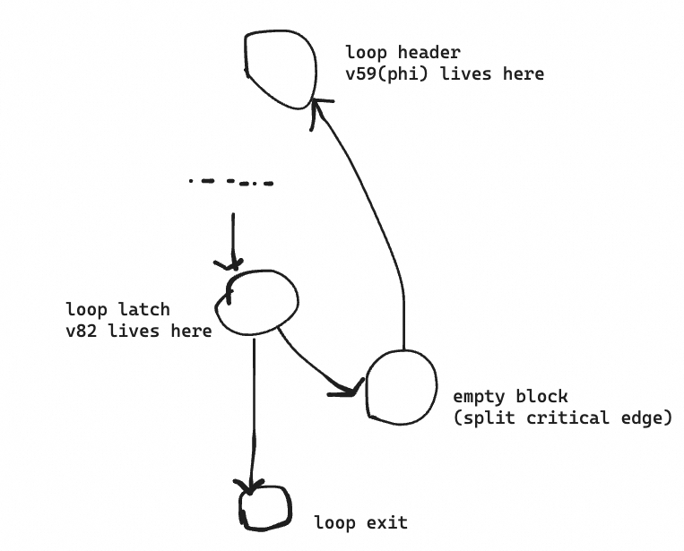
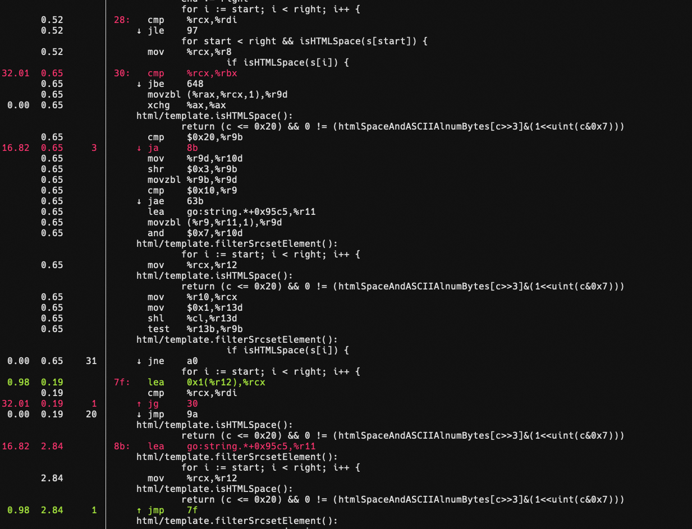
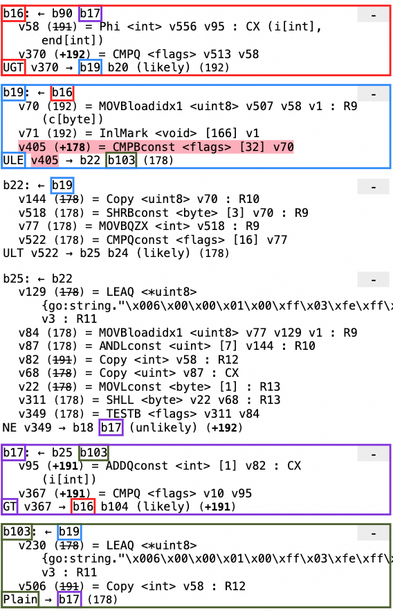
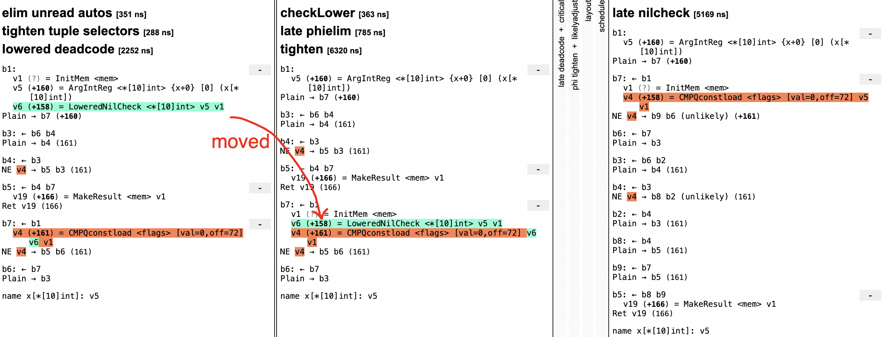

Recently, I proposed [Loop Invariant Code Motion(LICM)](https://github.com/golang/go/pull/64815) in Golang, this patch isn't in the main branch. I mainly wanted to share some details and the design thinking.

----

## 1. Loop Invariant Code Motion
The main idea behind LICM is to move loop invariant values outside of the loop
so that they are only executed once, instead of being repeatedly executed with
each iteration of the loop. In the context of LICM, if a loop invariant can be
speculatively executed, then it can be freely hoisted to the loop entry.
However, if it cannot be speculatively executed, there is still a chance that
it can be hoisted outside the loop under a few prerequisites:

- `#1 Instruction is guaranteed to execute unconditionally`
- `#2 Instruction does not access memory locations that may alias with other memory operations inside the loop`

For `#1`, this is guaranteed by loop rotation, where the loop is guaranteed to
execute at least once after rotation. But that's not the whole story. If the
instruction is guarded by a conditional expression (e.g., loading from a memory
address usually guarded by an IsInBound check), in this case, we try to hoist
it only if the loop invariant dominates all loop exits, which implies that it
will be executed unconditionally as soon as it enters the loop.
For `#2`, we rely on a simple but efficient type-based alias analysis to know
whether two memory access instructions may access the same memory location.

## 2. Type-based Alias Analysis
**Type-based Alias Analysis(TBAA)** is described in Amer Diwan, Kathryn S. McKinley, J. Eliot B. Moss: Type-Based Alias Analysis. PLDI 1998
TBAA relies on the fact that Golang is a type-safe language, i.e. different
pointer types cannot be converted to each other in Golang. Under assumption,
TBAA attempts to identify whether two pointers may point to same memory based
on their type and value semantics. They can be summarized as follows rules:
```
  #0 unsafe pointer may aliases with anything even if their types are different
  #1 a must aliases with b if a==b
  #2 a.f aliases with b.g if f==g and a aliases with b
  #3 a.f aliases with *b if they have same types
  #4 a[i] aliases with *b if they have same types
  #5 a.f never aliases with b[i]
  #6 a[i] aliases with b[j] if a==b
  #7 a aliases with b if they have same types
```

## 3. Loop Close SSA Form
**Loop closed SSA form(LCSSA)** is a special form of SSA form, which is used to simplify
loop optimization. It ensures that all values defined inside the loop are only
used within loop. The transformation looks up loop uses outside the loop and
inserts the appropriate "proxy phi" at the loop exit, after which the outside
of the loop does not use the loop def directly but the proxy phi.
```
   loop header:                         loop header:
   v3 = Phi(0, v4)                      v3 = Phi(0, v4)
   If cond->loop latch,loop exit        If cond->loop latch,loop exit

   loop latch:                          loop latch:
   v4 = Add(v3, 1)                =>    v4 = Add(v3, 1)
   Plain->loop header                   Plain->loop header

   loop exit:                           loop exit:
   v5 = Add(5, v3)                      v6 = Phi(v3)  <= Proxy Phi
   Ret v18                              v5 = Add(5, v6)
                                        Ret v18
```
Previously, v5 used v3 directly, where v5 is in the loop exit which is outside
the loop. After LCSSA transformation, v5 uses v6, which in turn uses v3. Here,
v6 is the proxy phi. In the context of LCSSA, we can consider the use block of
v6 to be the loop header rather than the loop exit. This way, all values defined
in the loop are loop "closed", i.e. only used within the loop.

Any further changes to the loop definition only need to update the proxy phi,
rather than iterating through all its uses and handling properties such as
This significantly simplifies implementation of **Loop Rotation**

## 4. Loop Rotation
### 4.1 CFG transformation
**Loop rotation**, also known as **loop inversion**, it transforms while/for loop to
do-while style loop, e.g.

```golang
// Before
for i := 0; i < cnt; i++ {
  ...
}

// After
if 0 < cnt {
  i := 0
  do {
    ...
  } while(i < cnt)
}
```
The original natural loop is in form of below IR
```
       entry
         │
         │  ┌───loop latch
         ▼  ▼       ▲
    loop header     │
         │  │       │
         │  └──►loop body
         ▼
     loop exit
```
In the terminology, loop entry dominates the entire loop, loop header contains
the loop conditional test, loop body refers to the code that is repeated, loop
latch contains the backedge to loop header, for simple loops, the loop body is
equal to loop latch, and loop exit refers to the block that dominated by the
entire loop.

We move the conditional test from loop header to loop latch, incoming backedge
argument of conditional test should be updated as well otherwise we would lose
one update. Also note that any other uses of moved values should be updated
because moved Values now live in loop latch and may no longer dominates their
uses. At this point, loop latch determines whether loop continues or exits
based on rotated test.

```
      entry
        │
        │
        ▼
    loop header◄──┐
        │         │
        │         │
        ▼         │
    loop body     │
        │         │
        │         │
        ▼         │
    loop latch────┘
        │
        │
        ▼
    loop exit
```
Now loop header and loop body are executed unconditionally, this may changes
program semantics while original program executes them only if test is okay.
A so-called loop guard is inserted to ensure loop is executed at least once.

```
        entry
          │
          │
          ▼
   ┌──loop guard
   │      │
   │      │
   │      ▼
   │  loop header◄──┐
   │      │         │
   │      │         │
   │      ▼         │
   │  loop body     │
   │      │         │
   │      │         │
   │      ▼         │
   │  loop latch────┘
   │      │
   │      │
   │      ▼
   └─►loop exit
```
Loop header no longer dominates entire loop, loop guard dominates it instead.
If Values defined in the loop were used outside loop, all these uses should be
replaced by a new Phi node at loop exit which merges control flow from loop
header and loop guard. Based on Loop Closed SSA Form, these Phis have already
been created. All we need to do is simply reset their operands to accurately
reflect the fact that loop exit is a merge point now.

One of the main purposes of Loop Rotation is to assist other optimizations
such as LICM. They may require that the rotated loop has a proper while safe
block to place new Values, an optional **loop land** block is hereby created to
give these optimizations a chance to keep them from being homeless.
```
         entry
           │
           │
           ▼
    ┌──loop guard
    │      │
    │      │
    │      ▼
    |  loop land <= safe land to place Values
    │      │
    │      │
    │      ▼
    │  loop header◄──┐
    │      │         │
    │      │         │
    │      ▼         │
    │  loop body     │
    │      │         │
    │      │         │
    │      ▼         │
    │  loop latch────┘
    │      │
    │      │
    │      ▼
    └─► loop exit
```

The detailed loop rotation algorithm is summarized as following steps

1. Transform the loop to Loop Closed SSA Form
  1.1 All uses of loop defined Values will be replaced by uses of proxy phis
2. Check whether loop can apply loop rotate
  2.1 Loop must be a natural loop and have a single exit and so on..
3. Rotate loop conditional test and rewire loop edges
  3.1. Rewire loop header to loop body unconditionally.
  3.2 Rewire loop latch to header and exit based on new conditional test.
  3.3 Create new loop guard block and rewire loop entry to loop guard.
  3.4 Clone conditional test from loop header to loop guard.
  3.5 Rewire loop guard to original loop header and loop exit
4. Reconcile broken data dependency after CFG transformation
  4.1 Move conditional test from loop header to loop latch
  4.2 Update uses of moved Values because these defs no longer dominates uses after they were moved to loop latch
  4.3 Add corresponding argument for phis at loop exits since new edge from loop guard to loop exit had been created
  4.4 Update proxy phi to use the loop phi's incoming argument which comes from loop latch since loop latch may terminate the loop now


Some gory details in data dependencies after CFG transformation that deviate from
intuition need to be taken into account. This has led to a more complex loop
rotation implementation, making it less intuitive.

### 4.2 Fix Data Dependencies
The most challenging part of Loop Rotation is the update of data dependencies
(refer to steps 3 and 4 of the algorithm).

#### Update conditional test operands
In original while/for loop, a critical edge is inserted at the
end of each iteration, Phi values are updated. All subsequent
uses of Phi rely on updated values. However, when converted
to a do-while loop, Phi nodes may be used at the end of each
iteration before they are updated. Therefore, we need to
replace all subsequent uses of Phi with use of Phi parameter.
This way, it is equivalent to using updated values of Phi
values. Here is a simple example:

Normal case, if v2 uses v1 phi, and the backedge operand v4
of v1 phi is located in the loop latch block, we only need to
modify the usage of v1 by v2 to the usage of v4. This prevents
loss of updates, and the dominance relationship will not be
broken even after v2 is moved to the loop latch.

```
Before:
 loop header:
 v1 = phi(0, v4)
 v2 = v1 + 1
 If v2 < 3 -> loop body, loop exit

 loop latch:
 v4 = const 512

After:
 loop header:
 v1 = phi(0, v4)

 loop latch:
 v4 = const 512
 v2 = v4 + 1
 If v2 < 3 -> loop header, loop exit
```
After updating uses of val, we may create yet another cyclic
dependency, i.e.
```
 loop header:
 v1 = phi(0, v4)
 v2 = v1 + 1
 If v2 < 3 -> loop body, loop exit

 loop latch:
 v4 = v2 + 1

After updating iarg of val to newUse, it becomes

 loop header:
 v1 = phi(0, v4)

 loop latch:
 v2 = v4 + 1   ;;; cyclic dependency
 v4 = v2 + 1
 If v2 < 3 -> loop header, loop exit
```
This is similiar to below case, and it would be properly handled
by updateMovedUses. For now, we just skip it to avoid infinite
recursion.

If there is a value v1 in the loop header that is used to define
a v2 phi in the same basic block, and this v2 phi is used in
turn to use the value v1, there is a cyclic dependencies, i.e.

```
loop header:
v1 = phi(0, v2)
v2 = v1 + 1
If v2 < 3 -> loop body, loop exit
```

In this case, we need to first convert the v1 phi into its
normal form, where its back edge parameter uses the value defined
in the loop latch.

```
loop header:
v1 = phi(0, v3)
v2 = v1 + 1
If v2 < 3 -> loop body, loop exit

loop latch:
v3 = Copy v2
```

After this, the strange v1 phi is treated in the same way as
other phis. After moving the conditional test to the loop latch,
the relevant parameters will also be updated, i.e., v2 will
use v3 instead of v1 phi:

```
loop header:
v1 = phi(0, v3)

loop latch:
v3 = Copy v2
v2 = v3 + 1
If v2 < 3 -> loop header, loop exit
```

Finally, since v3 is use of v2, after moving v2 to the loop
latch, updateMovedUses will update these uses and insert a
new v4 Phi.

```
loop header:
v1 = phi(0, v3)
v4 = phi(v2', v2)    ;;; v2' lives in loop guard

loop latch:
v3 = Copy v4
v2 = v3 + 1
If v2 < 3 -> loop header, loop exit
```
#### Update uses of moved Values because these defs no longer dominates uses after they were moved to loop latch
If the loop conditional test is "trivial", we will move the chain of this
conditional test values to the loop latch, after that, they may not dominate
the in-loop uses anymore:
```
  loop header
  v1 = phi(0, ...)
  v2 = v1 + 1
  If v2 < 3 ...

  loop body:
  v4 = v2 - 1
```

So we need to create a new phi v5 at the loop header to merge the control flow
from the loop guard to the loop header and the loop latch to the loop header
and use this phi to replace the in-loop use v4. e.g.
```
  loop header:
  v1 = phi(0, ...)
  v5 = phi(v2', v2)     ;;; v2' lives in loop guard

  loop body:
  v4 = v5 - 1

  loop latch:
  v2 = v1 + 1
  If v2 < 3 ...
```

#### Add corresponding argument for phis at loop exits since new edge from loop guard to loop exit had been created
Loop header no longer dominates loop exit, a new edge from loop guard to loop
exit is created, this is not reflected in proxy phis in loop exits, i.e. these
proxy phis miss one argument that comes from loop guard, we need to reconcile
the divergence

```
                              loop guard
                                    |
loop exit               loop exit  /
    |          =>            |    /
v1=phi(v1)              v1=phi(v1 v1') <= add missing g2e argument v1'
```

Since LCSSA ensures that all loop uses are closed, i.e. any out-of-loop uses
are replaced by proxy phis in loop exit, we only need to add missing argument
v1' to v1 proxy phi

#### Update proxy phi to use the loop phi's incoming argument which comes from loop latch since loop latch may terminate the loop now
Loop latch now terminates the loop. If proxy phi uses the loop phi that lives
in loop header, it should be replaced by using the loop phi's incoming argument
which comes from loop latch instead, this avoids losing one update.
```
Before:
  loop header:
  v1 = phi(0, v4)

  loop latch:
  v4 = v1 + 1

  loop exit
  v3 = phi(v1, ...)

After:
  loop header:
  v1 = phi(0, v4)

  loop latch:
  v4 = v1 + 1

  loop exit
  v3 = phi(v4, ...)  ;; use v4 instead of v1
```

## 5. Bug Fix
The loop exit created by BlockJumpTable will not be discovered by `findExits()`.


The current loop exits are only b23 and b43, but the expected ones should include b10 and b13.

## 6. Performance Regression
### 6.1 block layout
In original block layout algorithm, regardless of whether successors of the current basic block have `likely` attribute, the layout algorithm would place each successor right after the current basic block one by one. The improved algorithm employs a greedy approach, aiming to allocate the basic blocks of a "trace" together as much as possible, in order to minimize excessive jumps. i.e. For given IR:
```
b1:
BlockIf -> b2 b3 (likely)

b2:
BlockPlain->b4

b4:
...
```
The final block orders are as follows:
```
baseline:
b1 b2 b3 b4

opt:
b1 b2 b4 b3
```


### 6.2 register allocation
After loop rotation, there are some significant performance regression. Taking the strconv.Atoi benchmark as an example, the performance deteriorates by about 30%. In the following example:

```
;; baseline
b12
00025  JMP 30
00026  LEAQ (BX)(BX*4), R8
00027  MOVBLZX DI, DI
00028  INCQ AX
00029  LEAQ (DI)(R8*2), BX
00030  CMPQ AX, SI
b18
00031  JGE 38
00032  MOVBLZX (DX)(AX*1), DI
00033  ADDL $-48, DI
00034  CMPB DI, $9
b19
00035  JLS 26

;; opt
b27
00027  JMP 29
00028  MOVQ R8, AX
00029  MOVBLZX (DX)(AX*1), DI
00030  ADDL $-48, DI
00031  CMPB DI, $9
b19
00032  JHI 40
00033  LEAQ 1(AX), R8
00034  LEAQ (BX)(BX*4), BX
00035  MOVBLZX DI, DI
00036  LEAQ (DI)(BX*2), BX
00037  CMPQ SI, R8
b20
00038  JGT 28
b20
00039  JMP 43
```

In the code generated by the baseline, the loop includes 10 instructions `[26-35]`, whereas the optimized code contains 11 instructions `[28-38]`. This is because the baseline's loop increment instruction `i++` produced `incq ax`, while the optimized code generated is:

```
00028  MOVQ R8, AX
...
00033  LEAQ 1(AX), R8
```

The culprit is empty basic block created during the split critical edge after rotation, which affects the logic of register allocation;



During the register allocation process, for the instruction `v82 = ADDQconst <int> [1] v59`, the register allocator checks if v59 is in the next basic block and examines the expected register for v59. For example, if v59 is in the next basic block and its expected register is R8, then the register allocator would also allocate the R8 register for `v82 = ADDQconst <int> [1] v59`, because the input and result are in the same register, allowing the production of `incq`. However, after loop rotation, the next basic block for v82 is the newly inserted empty basic block from the split critical edge, preventing the register allocator from knowing the expected register for v59, so v82 and v59 end up being allocated to different registers, R8 and RAX, resulting in an extra `mov` instruction. The proposed fix is to skip empty basic block and directly check the next non-empty basic block for the expected register.

### 6.3 high branch miss
`BenchmarkSrcsetFilterNoSpecials` shows noticeable performance regression due to high branch mispredictions after the optimization.





The program execution flow is b16->b19->b103->b17->b16(loop), but b103 is placed below the loop latch b17, leading to high branch misses as illustrated above (ja 8b(goto b103),jmp 7f(goto b17), and jg 30(goto b16)). I propose to always place the loop header(or loop latch after real rotation) to the bottom of the loop.

## 7. Test fix
### 7.1 codegen/issue58166.go

`codegen/issue58166.go` fails, it expected loop increment to generate `incq`, but instead, it ended up generating `leaq+mov`.

During register allocation, v114 couldn't be allocated to the same register r8 as v149, due to the fact that there were two uses of v114 (v136 and v146) right after v149. As a result, unexpected instructions were produced.

```
b26:
v149 = ADDQconst <int> [1] v114
v135 = MULSD <float64> v87 v123
v136 = ADDSDloadidx8 <float64> v135 v50 v114 v160 ;;use of v114
v146 = MOVSDstoreidx8 <mem> v50 v114 v136 v160 ;; use of v114
v91 = CMPQ <flags> v15 v149
```
After loop rotation, the schedule pass calculated scores for b26, resulting in the following order:
```
Before schedule:
b26:
v135 (12) = MULSD <float64> v87 v123
v136 (12) = ADDSDloadidx8 <float64> v135 v50 v114 v160
v146 (12) = MOVSDstoreidx8 <mem> v50 v114 v136 v160
v149 (+11) = ADDQconst <int> [1] v114
v91 (+11) = CMPQ <flags> v15 v149
After schedule:
b26:
v149 = ADDQconst <int> [1] v114
v135 = MULSD <float64> v87 v123
v136 = ADDSDloadidx8 <float64> v135 v50 v114 v160
v146 = MOVSDstoreidx8 <mem> v50 v114 v136 v160
v91 = CMPQ <flags> v15 v149
```
An optimization was made as per https://go-review.googlesource.com/c/go/+/463751, which prioritizes values that are used within their live blocks. Since v149 is used by v91 in the same block, it has a higher priority.

The proposed fix is that if a value is used by a control value, then it should have the lowest priority. This would allow v146 and v91 to be scheduled closely together. After this scheduling, there would be no use of v114 after v146, thus allowing v146 and v114 to be allocated to the same register, ultimately generating an incq instruction.

### 7.2 test/nilptr3.go
```go
func f4(x *[10]int) {
  ...
  _ = x[9] // ERROR "generated nil check"
	for {
		if x[9] != 0 { // ERROR "removed nil check"
			break
		}
	}
}
```
Loop rotation duplicates conditional test Values into loop gaurd block:
```
...
loopGuard:
v6 (+159) = NilCheck <*[10]int> v5 v1
v15 (159) = OffPtr <*int> [72] v6
v9 (159) = Load <int> v15 v1
v7 (159) = Neq64 <bool> v9 v13
If v7 → b5 loopHeader

loopHeader:
v8 (+159) = NilCheck <*[10]int> v5 v1
v11 (159) = OffPtr <*int> [72] v8
v12 (159) = Load <int> v11 v1
v14 (159) = Neq64 <bool> v12 v13
Plain → b3
So we need to add a loop nilcheckelim pass after all other loop opts to remove the v6 NilCheck in the loop guard, but that's not the whole story.
```
The code `_ = x[9]` is expected to generate a nilcheck, but tighten pass will move the LoweredNilCheck from the loop entry b1 to the loop guard. At that point, there happens to be a CMPQconstload in the loop guard that meets the conditions for **late nilcheckelim**, resulting in the elimination of the LoweredNilCheck as well. Therefore, we also need to modify the test to no longer expect the generated code to contain a nilcheck.



### 7.3 test/writebarrier.go
```go
func f4(x *[2]string, y [2]string) {
	*x = y // ERROR "write barrier"

	z := y // no barrier
	*x = z // ERROR "write barrier"
}
```
We added loop opt pass after writebarrier pass, `*x = y` becomes dead store, simply removing ERROR directive fixes this case.