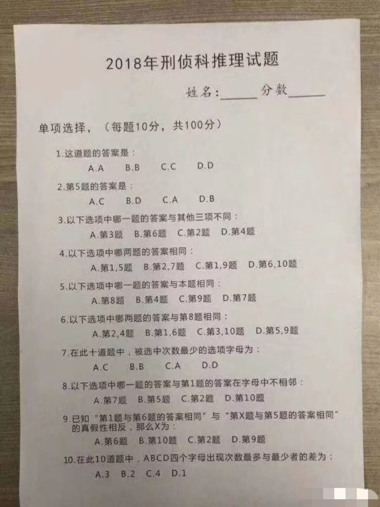

最近很火的刑侦推理题。。。我也是试了一下，答案是BCACA CDABA

如果直接推理是很难的，但借助计算机可以暴力无脑出结果(因为总共只有4^9=262144种情况)。具体做法是
1.首先生成所有可能的答案（递归生成解答树）
2.筛选掉不符合题目要求的（剪枝）
3.剩下唯一一个就是答案

附source code:https://pastebin.com/2a17Eqwu
```cpp

#include <algorithm>
#include <iostream>
#define pass

char answers[10];

// Auxiliary functions
int findMaxCount() {
    int abcd[4];
    for (int i = 0; i < 10; i++) {
        abcd[answers[i] - 'A']++;
    }
    return *std::max_element(abcd, abcd + 4);
};
int findMinCount() {
    int abcd[4];
    for (int i = 0; i < 10; i++) {
        abcd[answers[i] - 'A']++;
    }
    return *std::min_element(abcd, abcd + 4);
};
 
bool sameWithProblem8(int prob1, int probl2) {
    char problem8Anaswer = answers[7];
    if (problem8Anaswer == 'A') {
        if (answers[prob1 - 1] != 'A' || answers[probl2 - 1] != 'A')
            return false;
    }
    else if (problem8Anaswer == 'B') {
        if (answers[prob1 - 1] != 'B' || answers[probl2 - 1] != 'B')
            return false;
    }
    else if (problem8Anaswer == 'C') {
        if (answers[prob1 - 1] != 'C' || answers[probl2 - 1] != 'C')
            return false;
    }
    else if (problem8Anaswer == 'D') {
        if (answers[prob1 - 1] != 'D' || answers[probl2 - 1] != 'D')
            return false;
    }
    else {
        static_assert(true, "should not reach here");
    }
    return true;
};
 
// BCACA CDABA
// All 4^9=262144 occurrences could be enumerated in the solution tree
void enumerateing(int problemCnt) {
    if (problemCnt == 10) {
        // Check 1
        pass;
        // Check 2
        if (answers[1] == 'A') {
            if (answers[4] != 'C')
                return;
        }
        else if (answers[1] == 'B') {
            if (answers[4] != 'D')
                return;
        }
        else if (answers[1] == 'C') {
            if (answers[4] != 'A')
                return;
        }
        else if (answers[1] == 'D') {
            if (answers[4] != 'B')
                return;
        }
        else {
            static_assert(true, "should not reach here");
        }
        // Check 3
        if (answers[2] == 'A') {
            if (answers[2] == answers[5] || answers[2] == answers[1] || answers[2] == answers[3])
                return;
        }
        else if (answers[2] == 'B') {
            if (answers[5] == answers[2] || answers[5] == answers[1] || answers[5] == answers[3])
                return;
        }
        else if (answers[2] == 'C') {
            if (answers[1] == answers[2] || answers[1] == answers[5] || answers[1] == answers[3])
                return;
        }
        else if (answers[2] == 'D') {
            if (answers[3] == answers[2] || answers[3] == answers[5] || answers[3] == answers[1])
                return;
        }
        else {
            static_assert(true, "should not reach here");
        }
        // Check 4
        if (answers[3] == 'A') {
            if (answers[0] != answers[4])
                return;
        }
        else if (answers[3] == 'B') {
            if (answers[1] != answers[6])
                return;
        }
        else if (answers[3] == 'C') {
            if (answers[0] != answers[8])
                return;
        }
        else if (answers[3] == 'D') {
            if (answers[5] != answers[9])
                return;
        }
        else {
            static_assert(true, "should  not reach here");
        }
        // Check 5
        if (answers[4] == 'A') {
            if (answers[7] != 'A')
                return;
        }
        else if (answers[4] == 'B') {
            if (answers[3] != 'B')
                return;
        }
        else if (answers[4] == 'C') {
            if (answers[8] != 'C')
                return;
        }
        else if (answers[4] == 'D') {
            if (answers[6] != 'D')
                return;
        }
        else {
            static_assert(true, "should not reach here");
        }
        // Check 6
        if (answers[5] == 'A') {
            if (!sameWithProblem8(2, 4))
                return;
        }
        else if (answers[5] == 'B') {
            if (!sameWithProblem8(1, 6))
                return;
        }
        else if (answers[5] == 'C') {
            if (!sameWithProblem8(3, 10))
                return;
        }
        else if (answers[5] == 'D') {
            if (!sameWithProblem8(5, 9))
                return;
        }
        else {
            static_assert(true, "should not reach here");
        }
 
        // Check 7
        int abcd[4];
        for (int i = 0; i < 10; i++) {
            abcd[answers[i] - 'A']++;
        }
        char whichCharMinCount = 'A';
        int min = abcd[0];
        for (int k = 1; k < 4; k++) {
            if (abcd[k] < min) {
                min = abcd[k];
                whichCharMinCount = 'A' + k;
            }
        }
        if (answers[6] == 'A') {
            if (whichCharMinCount != 'C')
                return;
        }
        else if (answers[6] == 'B') {
            if (whichCharMinCount != 'B')
                return;
        }
        else if (answers[6] == 'C') {
            if (whichCharMinCount != 'A')
                return;
        }
        else if (answers[6] == 'D') {
            if (whichCharMinCount != 'D')
                return;
        }
        else {
            static_assert(true, "should not reach here");
        }
        // Check 8
        auto nearProblem1 = [=](int prob1)->bool {
            char problem1Answer = answers[0];
            if ((answers[prob1 - 1] - 1) == problem1Answer || (answers[prob1 - 1] + 1) == problem1Answer)
                return true;
            return false;
        };
        if (answers[7] == 'A') {
            if (nearProblem1(7))
                return;
        }
        else if (answers[7] == 'B') {
            if (nearProblem1(5))
                return;
        }
        else if (answers[7] == 'C') {
            if (nearProblem1(2))
                return;
        }
        else if (answers[7] == 'D') {
            if (nearProblem1(10))
                return;
        }
        else {
            static_assert(true, "should not reach here");
        }
        // Check 9
        if (answers[8] == 'A') {
            if ((answers[0] == answers[5] && answers[5] == answers[4]) ||
                (answers[0] != answers[5] && answers[5] != answers[4]))
                return;
        }
        else if (answers[8] == 'B') {
            if ((answers[0] == answers[5] && answers[9] == answers[4]) ||
                (answers[0] != answers[5] && answers[9] != answers[4]))
                return;
        }
        else if (answers[8] == 'C') {
            if ((answers[0] == answers[5] && answers[1] == answers[4]) ||
                (answers[0] != answers[5] && answers[1] != answers[4]))
                return;
        }
        else if (answers[8] == 'D') {
            if ((answers[0] == answers[5] && answers[8] == answers[4]) ||
                (answers[0] != answers[5] && answers[8] != answers[4]))
                return;
        }
        else {
            static_assert(true, "should not reach here");
        }
 
        // Check 10
        int diff = findMaxCount() - findMinCount();
        if (answers[9] == 'A') {
            if (diff != 3)
                return;
        }
        else if (answers[9] == 'B') {
            if (diff != 2)
                return;
        }
        else if (answers[9] == 'C') {
            if (diff != 4)
                return;
        }
        else if (answers[9] == 'D') {
            if (diff != 1)
                return;
        }
        else {
            static_assert(true, "should not reach here");
        }
        // Finally, we got the unique solution and print it
        std::cout << "Finally we got the unqiue solution:\n";
        for (auto x : answers) {
            std::cout << x;
        }
        std::cout << "\n";
        return;
    }
    for (char i = 0; i < 4; i++) {
        answers[problemCnt] = i + 'A';
        enumerateing(problemCnt + 1);
    }
}
 
int main() {
    enumerateing(0);
    getchar();
    return 0;
}
```
