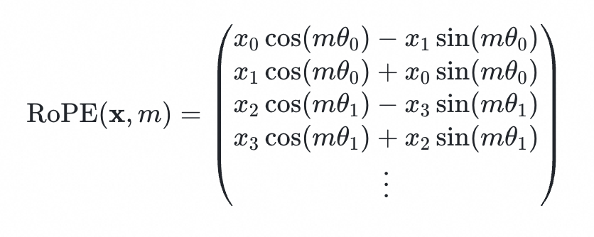

Recently, I implemented a so-called [ScholarEtude](https://github.com/y1yang0/scholar) minimal GPT model for learning purposes and trained it on
a fairly small dataset. I want to share some notes and thoughts on the training process.

What's happening with AI right now makes me think of the prologue's opening line
in [Red Dead Redemption 2](https://www.rockstargames.com/reddeadredemption2):

> By 1899, the age of outlaws and gunslingers was at an end.
> America was becoming a land of laws...
> Even the west had mostly been tamed.
> A few gangs still roamed but they were being hunted down and destroyed.

There isn't much time left for developers who code the old-fashioned way.

----

## AdamW Optimizer

最开始的实现是SGD，主要想体验下古法编程，手写重要实现

```python
def updateWeight(self, learningRate=1e-4):
    with torch.no_grad():
        for p in self.parameters():
            if p.grad is not None:
                p.data -= learningRate * p.grad
    self.clearGrad()

for input, target in dataset:
    output = self.compute(input)
    loss = torch.nn.functional.cross_entropy(output, target)
    loss.backward()
    self.updateWeight(learningRate)
```

现在为了推理效果和loss收敛，改成了pytorch自带的AdamW optimizer

```python
# self.optimizer = torch.optim.AdamW(self.parameters(), lr=learningRate)
for idx, (input, target) in enumerate(dataset):
    output = self.compute(input)
    loss = torch.nn.functional.cross_entropy(output, target)
    loss.backward()
    self.optimizer.step()
    self.optimizer.zero_grad()
```

## Training on GPU

我在H20-like机器上训练出来了下面的模型：

```json
{
    "dimEmb": 512,
    "numLayer": 8,
    "maxWindowSize": 512,
    "dropoutRate": 0.0,
    "learningRate": 3e-4,
    "numEpoch": 6,
}
```

残差、Pre-Norm、Attention、梯度裁剪，该有的基本上都有了，模型参数量是74831872(75M)，数据集使用金庸的全部小说，loss1.x左右，scholar最终会在2~词左右犹豫并输出，从指标上看应该可以了，但是推理效果非常不理想：

```shell
@@ Input: 请写一段两个人比武的描写
@@ Output: 请写一段两个人比武的描写一段。”说着向韦春芳瞧去。�
@@ Input: 杨过是谁
@@ Output: 杨过是谁？”苏州的种种种种种种�
@@ Input: 小龙女爱
@@ Output: 小龙女爱惜，她的好抚这小子，她的好抚�
```

我认为问题可能是没有多头注意力，另外询问LLM后，它还提到三个严重的问题：

1. tokenizer不适合中文分词
2. 一个数据集最好是一本书作为一个整体，而不是每一行作为一条数据集
3. argmax是贪心算法，缺少创造性

都是比较简单的问题，来挨个解决一下。

## Temperature Sampling

实现了temperature sampling之后，没有重复字了，但是模型智力应该完全没有提升，因为本质上只是吐下一个词的时候从贪心算法变成了概率采样算法，思考过程并没有任何变化。结果也显示推理效果确实毫无变化

```shell
@@ Input: 杨过和小龙女在
@@ Output: 杨过和小龙女在这里等候里干什么，你也不用�
@@ Input: 神雕大侠
@@ Output: 神雕大侠为神拳中致尔致小说，果然不�
@@ Input: 韦小宝和双儿
@@ Output: 韦小宝和双儿子大家都不到慈宁宫去见王爷、是谜
```

另外喂数据的方式也稍微改变了一下，遵循LLM的建议，现在金庸15本书整体作为一个数据集，加载到内存，然后512的滑动窗口在提取(input,target)chunk送入训练，最终推理效果依然没有太大提升。

## Multi-head Attention

缺少多头注意力是提升智能的关键，因为毕竟多个头可以关注不同的topic，单头只能关注一个。
所以完成上面的简单工作之后，我将单头注意力替换为了多头注意力。

最开始我的实现是，使用符合直觉的，但是可能会慢一些的方式，即用python list存放多个头，然后用for循环来进行多次矩阵运算。
但是我没有想到训练速度会慢了这么多。我印象里，之前一次训练20min左右，使用这种方式后，训练大概是40min一次。

所以我换了标准的形式，还是使用三个大矩阵表示Q,K,V，但是使用view来逻辑上拆分成多头。
```python
class Attention:
    def compute(self, x):
        query = x @ self.wQuery
        key = x @ self.wKey
        value = x @ self.wValue
        inputLen, dimEmb = x.shape
        dimHead = dimEmb // self.numHead
        queries = query.view(inputLen, self.numHead, dimHead).transpose(0, 1)
        keys = key.view(inputLen, self.numHead, dimHead).transpose(0, 1)
        values = value.view(inputLen, self.numHead, dimHead).transpose(0, 1)
        # Q(numHead, inputLen, dimHead) @ K^T(numHead, dimHead, inputLen)
        # = attnScore(numHead, inputLen, inputLen)
        attnScore = queries @ keys.transpose(-2, -1) / (dimHead ** 0.5)
        # attnScore(numHead, inputLen, inputLen) @ mask(numHead, inputLen, inputLen)
        # = maskedAttnScore(numHead, inputLen, inputLen)
        mask = torch.tril(torch.ones(inputLen, inputLen, device=x.device))
        attnScore = attnScore.masked_fill(mask == 0, -torch.inf)
        attnWeights = torch.softmax(attnScore, dim=-1)
        attnWeights = self.dropout(attnWeights)
        # (numHead, inputLen, inputLen) @ (numHead, inputLen, dimHead)
        # = out(numHead, inputLen, dimHead)
        out = attnWeights @ values
        out = out.transpose(0,1).contiguous().view(inputLen, dimEmb)
        return out @ self.wOut
```

实现过程中遇到一些困惑点。比如直觉上我认为(inputLen, dimEmb)的tensor，使用多头后应该是(numHead, inputLen, dimHead)的tensor，但是LLM告诉我应该`view(inputLen, numHead, dimHead).transpose(0, 1)`，我手动验证了一下才发现确实是这样的：
```python
>>> query = torch.tensor([[ 0,  1,  2,  3,  4,  5],
         [ 6,  7,  8,  9, 10, 11]])
>>> query.view(3,2,2)
tensor([[[ 0,  1],
         [ 2,  3]],
        [[ 4,  5],
         [ 6,  7]],
        [[ 8,  9],
         [10, 11]]])
>>> query.view(2,3,2).transpose(0, 1)
tensor([[[ 0,  1],
         [ 6,  7]],
        [[ 2,  3],
         [ 8,  9]],
        [[ 4,  5],
         [10, 11]]])
```
这样`view(inputLen, numHead, dimHead).transpose(0, 1)`之后，就得到了(numHead, inputLen, dimHead)的tensor。

使用多头注意力之后，推理的效果只能说基本也没变化，有点意外：

```shell
@@ Input: 杨过和小龙女在
@@ Output: 杨过和小龙女在而跪，官量中土竹，果然是中国�
@@ Input: 神雕大侠
@@ Output: 神雕大侠，指挥武官，都去慰染身�
@@ Input: 韦小宝和双儿
@@ Output: 韦小宝和双儿子大起称为“广东平西王带兵是谁
@@ Input: 围攻光明顶
@@ Output: 围攻光明顶，人数可好，他们就此信了。”
```

本来以为多头注意力是天神下凡，带来质变，结果量变都没有。

## Jinyong-specific Tokenizer

虽然Tokenizer很重要，但是我没啥兴趣实现它，所以网上随便找了一份代码，使用huggingface/tokenizer来基于当前dataset训练了一个tokenizer。词表大小设置为20000，模型参数从75M爆降到46M，几乎缩小了一半，想了想缩小的部分应该就是tokenEmbedding和out，我理解前一个是查表，后一个是思考之后向量转回id，我估计模型智慧并不会降低，先这样吧。

但是这里我犯了个错误，网上随便找的分词器用的byte-level，导致最后乱码：

```python
tokenizer.pre_tokenizer = ByteLevel()
# @@ Input: 杨过和小龙女在
# @@ Output: Ġ æĿ¨è¿ĩåĴĮå°ıé¾Ļ女 åľ¨ èĴ²åĽ¢ ä¸ĭ éĤ£ åľŁ æĹĹ äºº 临 ï¼ļ Ċ ãĢĢ ãĢĢ 顾çĤİæѦ éģĵ ï¼ļâĢľ 飦é¦Ļ主 åIJ©åĴIJ ä¸Ń è¿Ļä¸Ģ å¥Ĺ æĪij è¿Ľ åijĪ æĬļ ï¼Į è·ŁçĿĢ 大人 ãĢĤâĢĿ Ċ ãĢĢ ãĢĢ
```

白忙活一场，只能重头再来，先训练tokenizer再训练模型。这一次训练了10个epoch，loss 3.x，e^3.x≈20，说明scholar基本在20~30词左右犹豫并输出。中文分词优化后，推理效果如下：

```shell
@@ Input: 杨过和小龙女在
@@ Output: 杨过和 小龙女 在 沐剑屏 怀里 低声 。 七个 夫妻 相处 ， 韦小宝 化 装 清风 来 ， 多隆 和 康熙 西征 ， 乾 清 王府中 共 享 大名 格 等 ， 要 来的
@@ Input: 神雕大侠
@@ Output: 神雕 大侠 ， 一条 长 枪 刺死 ， 鬼 口 ， 今日 鞑子兵 也不知 杀头 还是 奉 旨 ， 弃 斩 ， 挺 有 忠 ， 死 约会 。 ” 韦小宝道 ：
@@ Input: 韦小宝和双儿
@@ Output: 韦小宝和 双儿 、 李力世 、 钱老本 等 四人 走入 书房 的 艇 首 坐下 ， 都觉 心有 快 。 韦小宝 又叫 曾柔 进来 ， 当即 站起 。 韦小宝 吩咐 道 ： “
@@ Input: 围攻光明顶
@@ Output: 围攻 光明顶 走一 举 ， 视 曹 寅 四周 设 说 治 奏 折 中 修 造 奏 折 公 ， 和 顺势 向 康熙 请教 ， 反 大人 恭 请 顾
@@ Input: 郭靖和黄蓉
@@ Output: 郭靖 和 黄蓉 商议 ， 只听得 双儿 和 曾柔 二人 都 聚 一些 ， 众人 知道 韦小宝 为了 这件事 。 苏荃 道 曾柔 说了 七个 “ 韦香主 ” 三字 ， 只得 依言 转身
@@ Input: 张无忌
@@ Output: 张无忌 这么 一分 ， 登时 脸上 溅 上 毛 ， 慢慢 低头 ， 容色 艳 丽 ， 一阵 晕眩 ， 韦小宝 忙 缩回 ， 大声道 ： “ 你去 吧 。 ”
@@ Input: 令狐冲说
@@ Output: 令狐冲 说 ： 你答允 我来 跟 韦香主 理 小玄 架子 ， 要 咱们 生气 ， 天地会 众兄弟 不幸 惨 报 告 。 除了 之女 之外 ， 其余 众位兄弟 韦小宝 一人 推举 帮主
```

**scholar推理效果提升巨大**，我的理解是scholar不再需要学习将6个byte当作一个token的能力（比如"杨过"是一个整体），天生获得了这个能力，它的参数可以关注其他更重要的语法和语义。这也许也可以解释为什么多头注意力没有达到预期的效果，因为模型大部分参数都用在理解认词了，它根本还没到多头注意力来捕捉深层语义（指代关系，情感倾向，人物关系等）的阶段。

## Dataset Shuffle

我的数据集构建方式是把15本书拼成一个超大字符串，然后每513token作为一个chunk([0:512],target[1:513])，最终数据集是[chunk1,chunk2,...]
我给数据集加了`random.shuffle`，并且epoch调整到20，最终loss降低到了2.x的水平，但是推理结果好像反而更差了
```shell
@@ Input: 杨过和小龙女在
@@ Output: 杨过和 小龙女 在 饭铺 外 睡着 相助 找寻 ， 发觉 她 眼光 自 较 ， 兀自 鼓 励 心神 ， 心 无所 定 ， 心花怒放 ， 说道 ： “ 小姑娘 ， 你怎么 来的
@@ Input: 神雕大侠
@@ Output: 神雕 大侠 ， 你一 听 从 直 说到 ‘ 仇 报 德 ’ ， 他 还是 惹 他 生气 的 ？ 然而 耿 派了 、 广东 、 西夏 各 赐 一条 羊
@@ Input: 韦小宝和双儿
@@ Output: 韦小宝和 双儿 满脸 喜悦 的神色 ， 却 缓缓 藏在 计策 的 骷髅 像 ， 单 做 下了 人 。 那 假 造 的 套 女 既有 罗刹 鬼 ， 总是 每 几天
```
我理解虽然shuffle避免过拟合，但是shuffle也打乱了模型理解一本书的叙事连续性，所以效果反而更差了？我决定试试shuffle开启关闭的具体效果。
另外现在看来loss指标已经不能准确说明推理效果了，所以我改了一下，每轮epoch训练之后，走一遍推理，肉眼看看推理效果。

**predict_every_epoch+shuffle**:
```shell
@@ Input: 神雕大侠
...
@@ Epoch: 8  Output: 神雕 大侠 主 这一拳 无声无息 ， 很 怕你 。 黄蓉 此时 不论如何 原委 ， 惟 忠 知他 心意 ， 却 遭 此 横 棒 细 棒 刺中 他胸口 膻中穴 。 郭靖 此时
@@ Epoch: 9  Output: 神雕 大侠 给自己 。 无色 知他 虽 不是 杨过 ， 沉吟片刻 ， 脸色 一 白 ， 见 二道 倒 唇 相 看 ， 倒 跃出 鼻 管 。 杨过 身中 玉蜂针 ，
@@ Epoch: 10 Output: 神雕 大侠 细 密 ， 眼中 登时 粘 着一 块 岩石 出来 ， 飞 迅 雷 鸣 ， 通 体 落地 。 杨过 眼见 是 李莫愁 ， 要 设法 抢夺 小龙女 克制

@@ Input: 韦小宝和双儿
...
@@ Epoch: 8  Output: 韦小宝和 双儿 抢到 客店 ， 大叫 ： “ 是 故意 救你 家 吗 ？ ” 双儿 飞起 手 ， 格 开了 门闩 ， 将她 踢 了个筋斗 ， 喝道 ： “ 快 放手
@@ Epoch: 9  Output: 韦小宝和 双儿 又 见那 名 武士 身材魁梧 的大 姑娘 华贵 ， 女的 相貌 一模一样 ， 相貌 俊美 婀 娜 的 ， 容貌 丑陋 ， 形 色 真假 ， 一个 白 嫩 丽
@@ Epoch: 10 Output: 韦小宝和 双儿 展开轻功 ， 三人 挥 斧 ， 双剑 合 被 擒获 ， 三人 剑招 迅捷 ， 难以 伤 敌 ， 不料 三人 剑法 精奇 。 长乐帮 和 夏 胄 突然 斗得
```

**predict_every_epoch+no_shuffle**:
```shell
@@ Input: 神雕大侠
...
@@ Epoch: 8  Output: 神雕 大侠 ， 这才 不及 防 。 他 只要一 死心 塌 糊涂 ， 心想 ， 这 马 的人 之中 ， 总得 把 天下百姓 报 自 对 报信 ， 再 得 天地会 会众
@@ Epoch: 9  Output: 神雕 大侠 做官 ， 忠 字 ， 如 韦香主 天下第一 。 韦香主 ， 我 汉人 只一 着 不用 ， 天下 哪有 这么 ？ 这是 大大的 好人 吗 ？ ” 韦小宝笑道 ： “
@@ Epoch: 10 Output: 神雕 大侠 打 听到 ， 天下 人都 顺 天府 ， 喝 喜 酒 。 我这 件事 天天 重重 有 斟 ， 念着 你做 吴 府 知府 ， 这时 低声 隔 桌 的

@@ Input: 韦小宝和双儿
...
@@ Epoch: 8  Output: 韦小宝和 双儿 去 抱 脚 的 毕生 垫 了 路 ， 这才 途中 疑 思 机 先 ， 去 立 康熙 进 关 。 康熙 当然 只 派 天地会 众兄弟 齐 来
@@ Epoch: 9  Output: 韦小宝和 双儿 一一 到来 该当如何 ？ 他 昨日 亲眼 得见 总管 韦香主 ， 哽 天下 汉人 人数 务 ， 天下 闻 闻 之事 ， 总算 韦香主 跟着 提心吊胆 。 那知 韦小宝 筹划
@@ Epoch: 10 Output: 韦小宝和 双儿 ， 和 众兄弟 混 奏 。 这倒 奇 谈 得很 。 ” 韦小宝 见韦小宝 唯 否 降 ， 拉着他 交给 沐剑屏 ， 说道 ： “ 胡闹 ！ ” 康熙道 ：
```
这样对比下来，感觉shuffle打开效果更好，挨个子里拔将军，epoch9~10是最优秀的轮次。所以总结来说，shuffle没有问题，有问题的是epoch太多，导致过拟合了。

## Batched Training

继续优化。之前的实现每次训练（包括计算loss）都是使用一个样本，相当于模型每次的目标是学一句话，并且达到目标水平，现在batched dataset之后就是每次学batchSize=16句话。显然前者问题很多，包括但不限于梯度不稳，而且容易过拟合，坏处很多

batched dataset之后，还需要同步修改attention和loss的计算过程，因为之前attention接受的输入维度是`(inputLen,dimEmb)`，现在是`(batchSize, inputLen, dimEmb)`

```python
class Attention:
    ...
    def compute(self, x):
        # compute Q,K,V at once
        query = x @ self.wQuery
        key = x @ self.wKey
        value = x @ self.wValue
        # split the Q,K,V tensor into multiple heads, each head has dimHead
        # dimensions. Intuitively, I view old [batchSize, inputLen, dimEmb] as
        # [batchSize, numHead, inputLen, dimHead], but it turns out that it
        # should be firstly viewed as [batchSize, inputLen, numHead, dimHead] 
        # and transpose(1,2) dimensions to get the desired shape
        batchSize, inputLen, dimEmb = x.shape
        dimHead = dimEmb // self.numHead
        queries = query.view(batchSize, inputLen, self.numHead, dimHead).transpose(1, 2)
        keys = key.view(batchSize, inputLen, self.numHead, dimHead).transpose(1, 2)
        values = value.view(batchSize, inputLen, self.numHead, dimHead).transpose(1, 2)
        # compute Attention(Q,K,V) = softmax(mask(Q@K^T / sqrt(d_k))) @ V
        #
        # attention socre means which tokens are most relevant to current token
        #   Q(batchSize, numHead, inputLen, dimHead) @ K^T(batchSize, numHead, dimHead, inputLen)
        #   = attnScore(batchSize, numHead, inputLen, inputLen)
        attnScore = queries @ keys.transpose(-2, -1) / (dimHead**0.5)
        # use causal mask to prevent the current token from seeing future tokens
        #   attnScore(batchSize, numHead, inputLen, inputLen) @ mask(batchSize, numHead, inputLen, inputLen)
        #   = maskedAttnScore(batchSize, numHead, inputLen, inputLen)
        mask = torch.tril(torch.ones(inputLen, inputLen, device=x.device))
        attnScore = attnScore.masked_fill(mask == 0, -torch.inf)
        # apply softmax to get the attention weights
        attnWeights = torch.softmax(attnScore, dim=-1)
        # apply dropout to prevent overfitting
        attnWeights = self.dropout(attnWeights)
        # apply weights to the values to get the output
        #   attnWeights(batchSize, numHead, inputLen, inputLen) @ V(batchSize, numHead, inputLen, dimHead)
        #   = out(batchSize, numHead, inputLen, dimHead)
        out = attnWeights @ values
        # merge all attention heads back and apply final projection to understand how to 
        # combine the information from all heads
        #   out(batchSize, numHead, inputLen, dimHead)
        #   = out(batchSize, inputLen, dimEmb)
        out = out.transpose(1, 2).contiguous().view(batchSize, inputLen, dimEmb)
        return out @ self.wOut
```

10轮训练后，推理效果如下:

```shell
@@ Input: 杨过和小龙女在
@@ Output: 杨过和 小龙女 在 古墓中 出来 ， 见郭靖 将 短剑 轻轻 放 在他 颈中 ， 心中 已 感到 说不出的 欢喜 。 小龙 女 向杨过 呆呆出神 ， 道 ： “ 你师父 这般 畏惧 ， 你 是一
@@ Input: 神雕大侠
@@ Output: 神雕 大侠 一对 花 花 绘 成 ， 在 花 树下 旁的 花 枝 叶 之上 ， 虫 登时 浸 为 食 。 群豪 中 却 寂 中 。 又 饥 呼
@@ Input: 韦小宝和双儿
@@ Output: 韦小宝和 双儿 ， 见到了 鞋子 ， 已经 缩回 ， 却 再也 别无 他 ， 怒 得 急了 ， 骂道 ： “ 死 顽皮 ， 活  的 鬼 还没死 ， 老子 不 摔
@@ Input: 围攻光明顶
@@ Output: 围攻 光明顶 包 藏 出来 。 ” 洪七公 虽 浑 浑 然不 信 ， 但 五 味 药 店 听得 多了 ， 只得 省 起 一张 匙  羹 ， 舀 了一 匙
@@ Input: 郭靖和黄蓉
@@ Output: 郭靖 和 黄蓉 心中怦怦乱跳 ， 都 吃了一惊 。 梁子翁 知道 她 竟会 都 和自己 亲见 。 却见 身后 有个 少年  浑 不相同 ， 心中 惴惴 不安 ， 此人 并未 施展 ， 脚下 比
@@ Input: 张无忌
@@ Output: 张无忌 大奇 。 这一次 他 脸上 阴 沉沉的 变 黑色 布 ， 凭 手 按 摩 ， 大声说道 ： “ 那 番僧 炮 呢 ？ ”  他 越 叫 越 王
@@ Input: 令狐冲说
@@ Output: 令狐冲 说 便是 任教主 数次 ， 只是 高高 挂 单 身 东西 来 生气 ， 到头来 这才 失 信 上 疑 。 ” 令狐冲心 道 ： “ 是了 ， 叫做 ‘ 热 茶
```

**又一次scholar推理能力飞跃。**

比如这句话，都有点剧情的味道了，语法也基本正确：

> 杨过和 小龙女 {在 古墓中 出来 ， 见郭靖 将 短剑 轻轻 放 在他 颈中 ， 心中 已 感到 说不出的 欢喜 。 小龙 女 向杨过 呆呆出神 ， 道 ： “ 你师父 这般 畏惧...}

## SwiGLU based FFN

目前Scholar低垂的果实已经没多少了，多头、Batch、中文分词都搞完了，数据集我又不想新增，只能继续优化模型细节。

之前FFN是一个传统的GELU实现

`FFN(x) = GELU(x @ wUpProj) @ wDownProj`

根据我的粗浅理解，相当于先升维（512->512*4），在高维空间寻找相似特征(比如"杨过","断了"),然后过激活函数决定开启/关闭某些特征,最终再降维（512*4->512）,根据激活的特征提取具体的知识(找到"断臂","郭芙")。

听说现在都流行SwiGLU,我又把FFN改造成了SwiGLU的形式：

`SwiGLU(x) = (SiLU(x @ wGate) * x @ wValue) @ wOut`

SwiGLU是Google提出的一种改进的FFN结构，我理解是这样,两者都是先将上下文x升维(比如"杨过","断了"),只是说SwiGLU将x同时升维成两份,一份门控矩阵,一份内容矩阵,门控部分经过SiLU激活函数后成为一个0~1的系数矩阵,和内容矩阵逐元素相乘,相当于可以按照权重提取特征(之前FFN只能要么提取特征,要么不提取特征,现在可能是"杨过"100%激活,"断了"提取80%身体器官断,提取10%感情断),最后降维没啥区别,都是根据特征找到具体知识(找到"断臂","郭芙")

这个版本推理效果如下:

```shell
@@ Input: 杨过和小龙女在
@@ Output: 杨过和 小龙女 在 终南山 相距 甚远 。 杨过 走近身去 ， 又惊又喜 ， 说道 ： “ 姑姑 ，  你 逃 么 ？ ” 小龙女 哼了一声 ， 道 ： “ 这般 多礼 ， 你这小 娃儿
@@ Input: 神雕大侠
@@ Output: 神雕 大侠 这三人 ， 乘 人之 危 ， 只 袖手旁观 ， 只 这少年 发 挥 ， 自己也 一句 ， 竟 为 老毒物 所 激 ， 却 没法 分开 武功 比 喻 ，
@@ Input: 韦小宝和双儿
@@ Output: 韦小宝和 双儿 ！ ” 陈近南道 ： “ 都统大人 ， 请你 送 正 堂 执法 。 ” 当下 众弟子 齐声答应 。 尹 章 文 等三人 听 由 姚 春 道 命令 ， 但
@@ Input: 围攻光明顶
@@ Output: 围攻 光明顶 走一 郎 ， 路 道 这条 道 路 说 知 已到了 山 州 夷 山 之 境 ， 在 河南 城 外 的 地势 大为 减 。 路 派 那 宋
@@ Input: 郭靖和黄蓉
@@ Output: 郭靖 和 黄蓉 只因 练 内功 时 便已 迷 存 ， 遇到 一些 功夫 就 起始 学 学 ， 旁边 毫不 学 乍 能 压 少 ， 这才 有 用 计 收拾 ，
@@ Input: 张无忌
@@ Output: 张无忌 拿着 铁 片 ， 交给 鸠摩智 人的 侧 了几眼 ， 低头 看时 ， 却是个 拐杖 ， 忍不住 喝彩 。 他 这么一 笑 ， 说道 ： “ 我还道 我 有什么 古怪
@@ Input: 令狐冲说
@@ Output: 令狐冲 说 ： “ 你们 认 不 至 义 ， 还是 要 咱们 生气 ？ ” 只听 田伯光 又 伤心 ， 又  恼怒 ， 又 安慰 道 ： “ 那 第十 慈
```

**scholar推理能力实质性提升**,除了三四句话外,其他的续写内容都比较通顺和流畅

这让我比较惊讶,但是细想之下,也不能说这种提升全是SwiGLU的功能,可能是这一系列优化的累计效应

## [X] Smaller vocabSize

之前的tokenizer的词汇表是20000词，现在重新训练tokenizer，调整到8000词:

```shell
@@ Input: 杨过和小龙女在
@@ Output: 杨过 和 小龙女 在 屋 前 ， 都 微 感 奇怪 ， 一时 将 二人 前 要 到 旷 中 调 使 水 法 “ 火 焰 刀 ” ， 古墓 中 寂 静
@@ Input: 神雕大侠
@@ Output: 神雕 大侠 无 情 。 襄阳 城中 到处 历 强 人 生 掣 城 以 来 迎 敌 ， 弃 富 贵 ， 甚为  累 ， 生 中 岂不是 一 世 血
@@ Input: 韦小宝和双儿
@@ Output: 韦小宝 和 双儿 分 较 ， 登时 便有 十余 名 蓝 锦 艇 四 层 ， 远远 站在 其 后 。 韦小宝 一怔 ， 低声道 ： “ 师太 慷 慨 ， 原来 这
@@ Input: 围攻光明顶
@@ Output: 围 攻 光明 顶 ， 更是 大 雾 积 雪 ， 国 武士 却不 来 攻 城 外 ， 那是 免 了 西 和 回 事 。 黄蓉 心中 反 想 ： “ 宋
```

调整到12000词：

```shell
@@ Input: 杨过和小龙女在
@@ Output: 杨过 和 小龙女 在 古墓 之中 突然 一 发 劲 ， 手中 一道 剑 竟 斩 之 坚 ， 公孙 衫 上 。 小龙女 凝 牙 舞 足 摔 在大 树 之下 ， 乘势
@@ Input: 神雕大侠
@@ Output: 神雕 大侠 ， 一条 长 索 。 他武功 既 避 开了 今日 ， 此 女 尼 嘴 剪 袭 ， 实 不 亚 绿竹 之下 ， “ 子弟 亏 你们 这些 高
@@ Input: 韦小宝和双儿
@@ Output: 韦小宝 和 双儿 、 阿珂 同 情 ， 跟随 着她 谈 到 她的 亏 少了 怒 ， 待 见他 一只 柔 腻 娇 柔 腻 的 ， 十几 颗 眼泪 也 钻 入了
@@ Input: 围攻光明顶
@@ Output: 围攻 光明顶 。 张召重 想 瞧他 如何 挡 ？ ” 张召重 道 ： “ 你 输了 ， 却 先 动手 ， 然后 再 想 一想 很好 ， 反 在你 身上 再 出
```

相比于2000词，推理效果变差了，一次失败的炼丹。

## [X] Weight Tying

将tokenEmbeding和out的权重绑定在一起，减少模型参数量，加快loss收敛，实现非常简单

```python
self.tokenEmbedding = torch.nn.Embedding(self.tokenizer.vocabSize(), dimEmb)
self.out = torch.nn.Linear(dimEmb, self.tokenizer.vocabSize(), bias=False)
# tie the output projection with the token embedding to save memory
self.out.weight = self.tokenEmbedding.weight
```

这里比较迷惑人的是初看tokenEmbedding和out形状不一样，一个(vocabSize, dimEmb)，一个(dimEmb, vocabSize)，但是pytorch的Linear层的权重是(vocabSize, dimEmb)，在 `x @ Linear`会自动调用`x @ Linear.weight.T`，所以这里直接绑在一起是可以的。

这个改动理论上应该不影响推理能力，主要是减少模型参数量。

但是结果非常意外，**推理效果变差了，loss收敛也变差了**，之前大概8轮就收敛到2.x，现在需要40轮才能收敛到2.x

```shell
@@ Epoch: 31 Progress: 99.42% Loss: 2.7289
@@ Input: 杨过和小龙女在
@@ Output: 杨过和 小龙女 在 变招 ， 押着 最 白龙使 ， 只因 她 经过 的 出去 ， 夜 半点 血色 ， 知道 大师哥 ， 这两 些 练 ， 那 得手 了 床前 ， 砰的一声 ，
@@ Epoch: 32 Progress: 99.42% Loss: 2.5781
@@ Input: 杨过和小龙女在
@@ Output: 杨过和 小龙女 在 李莫愁 ， 这是 在一 凌空 ， 已 却在 星宿老怪 ， 龙 二人 虽 强 ， 有恃无恐 典 故 ， 轻声道 中 红 堕 司空 ， 当世 更 有一 柄 ，
...
```

把weight tying改动revert掉，然后发现loss收敛变好了，推理效果也变好了。

```shell
# 无weight tying
@@ Epoch: 5 Progress: 99.42% Loss: 3.3901
@@ Input: 杨过和小龙女在
@@ Output: 杨过和 小龙女 在 古墓 之中 ， 周伯通 脸上 不肯 为人 变 ， 杨过 低头 ， 手 原 也 记 错 ， 心想 ： “ 那 呢 ？ ” 那少女道 ： “ 那两人 且
@@ Epoch: 6 Progress: 99.42% Loss: 2.9618
@@ Input: 杨过和小龙女在
@@ Output: 杨过和 小龙女 在 胡思乱想 ， 数次 伤害 了他 理 门户 ， 此时 必须 有人 生气 ， 杨过 来 轻轻 推 上 等 他们 身上 ， 他本来 在 桃花岛上 意 问 ， 自是 欢喜
...
```

weight tying作为现代大模型标配，而且理论也比较合理，出现这种情况完全不能理解。
可能的解释是，token embedding和out在大模型充分学习的情况下，两者相似，但是对于我这个数据量小+模型参数小的情况下，两者不相似？本来scholar模型在token embedding层学习到怎么将token映射到embedding vector，比如杨过和小龙女到相似空间位置，降龙十八掌和打狗棒法到相似空间位置，out层学习到怎么根据上下文向量预测最合适的下一个词，但是权重共享后，两个任务共享一个参数，手忙脚乱了？

另外网上也搜到了一些weight tying导致推理性能变差的文章，有点怀疑weight tying那篇论文的可靠性，总之，还是**先不用weight tying了**

## [X] Cosine Annealing

我知道adamw已经可以调整学习率了，不是非常理解为什么还需要一个scheduler再调节学习率。
让LLM介绍了一下：

> 1. AdamW：微观层面的“自适应”调整
> AdamW（Adam with Decoupled Weight Decay）是一种优化器。它的核心是 “自适应学习率”。
> 作用对象：针对模型中的每一个参数。
> 工作原理：AdamW 会跟踪每个参数梯度的一阶矩（动量）和二阶矩（梯度的平方的移动平均值）。基于这些历史信息，它会为每个参数独立地计算出一个有效的学习率。
> 如果某个参数的梯度一直很大且稳定，AdamW 可能会稍微降低它的学习率，防止更新步子太大导致震荡。
> 如果某个参数的梯度很小或很不稳定，AdamW 可能会稍微提高它的学习率，帮助它更快地更新。
>
> 2. 余弦退火：宏观层面的“策略性”调度
> 余弦退火（Cosine Annealing）是一种 学习率调度器（Learning Rate Scheduler）。
> 作用对象：作用于整个优化器（如AdamW）的全局基础学习率（lr）。
> 工作原理：它根据一个预先设定的策略，在整个训练过程中周期性地调整全局学习率。余弦退火的策略是：
> 初始阶段：保持一个相对较高的学习率，让模型能够大步探索，快速跳出不好的局部最优解。
> 中间阶段：学习率按照余弦函数的形状平滑地、缓慢地下降。
> 结束阶段：学习率下降到接近于0，让模型能够在已经找到的“最优解山谷”中进行精细微调，从而更好地收敛。

我的理解是，CosineAnnealingLR相当于决定当前是国道（限速40-80）还是告诉高速（限速-120），然后AdamW再微调速度

我将learningRate从固定的3e-4改成了cosine decay，衰减是0.1倍，改动比较简单，pytorch自带了CosineAnnealingLR调度器

```python
# create CosineAnnealingLR scheduler
scheduler = torch.optim.lr_scheduler.CosineAnnealingLR(self.optimizer, T_max=numIter, eta_min=learningRate*0.1)

for idx, (input, target) in enumerate(batches):
    input, target = ...
    loss = functional.cross_entropy(output, target)
    loss.backward()
    self.optimizer.step()
    scheduler.step() # update learning rate
    self.optimizer.zero_grad()
```

然后推理再次让人惊讶，效果变差了，我移除了Cosine decay，然后推理能力又回来了，和SwiGLU那个版本的效果相当，但是这不能完全说明CosineAnnealingLR不合适，因为我犯了个错误，我是每个batch调用一次CosineAnnealingLR更新学习率，但是标准实践是在每个epoch结束时调用一次，我的写法有点问题，所以这次我把cosine decay的调用位置改成了每个epoch结束时调用一次，推理效果如下：

```shell
@@ Input: 杨过和小龙女在
@@ Output: 杨过和 小龙女 在 寒玉 崖 前 半 路 ， 便 跟 小龙女 与 小龙女 的说话 ， 却已 好生 记挂 ， 说道 ： “ 杨过 ， 我 邀 赵志敬 ， 甄志丙 到来 ， 那
@@ Input: 神雕大侠
@@ Output: 神雕 大侠 ” ， 极是 嘶哑 。 滕一雷 白 眼 ， 昂 然 向外 张 ， 只得 双足 直 跌 下去 ， 将 三 柄 沉 入 岩 脚上 。 关明梅 大惊
@@ Input: 韦小宝和双儿
@@ Output: 韦小宝和 双儿 和 阿琪 四人 都 将 嘴巴 捏 得 压 在自己 面前 。 洪夫人 喝问 ： “ 原来 是他 … … ” 双儿 咳嗽 ， 说道 ： “ 天 … …
@@ Input: 围攻光明顶
@@ Output: 围攻 光明顶 ， 须 赶上 锐金旗 而成 … … … ” 注 ： “ 计策 ？ ” 说着 按 在一旁 。 令狐冲 哈哈大笑 ， 道 ： “ 这人 武功 如此 之快 ，
@@ Input: 郭靖和黄蓉
@@ Output: 郭靖 和 黄蓉 对 黄蓉 虽 不识 是 讥刺 于她 ， 或 入鞘 。 欧阳克 一扯 郭靖 衣袖 ， 竹棒 脱手 ， 直 抢 到了 黄蓉 身上 。 欧阳克 左手 向 人丛中 斜
```

还是不理想。我又经过多次验证，加上CosineAnnealingLR的推理效果是绝大部分轮次都不如不加，而不是某一轮不如，所以只能去掉cosine decay。

## Kaiming Initialization

最开始我用的是`torch.nn.Parameter()`，现在替换成了`torch.nn.Linear`，它默认使用Kaiming initialization，这样参数初始化更合理。

推理效果基本上没有变化

## Validation Loss

现在模型每轮训练完，是手动调用几次推理函数，然后输出推理结果，通过肉眼来看推理效果，判断是否训练合适，是否过拟合。这个方式有些滑稽，了解了一下现在大模型训练用的方式一般是将数据集90%用于训练，10%用于验证，也就是说先给90%的数据训练完成后，使用10%模型从没见过的训练集，求一下val loss，看看模型的表现。

- 如果train loss和val loss都持续下降然后稳定，说明模型泛化能力不错
- 如果train loss下降，val loss上升，说明过拟合

这种看val loss数据比肉眼看推理效果要方便很多，所以我实现了val loss，它和训练代码非常相似，唯一的区别是loss算出来之后不需要反向传播然后修正权重：

```python
@torch.no_grad()
def validate(self):
    global isTraining
    isTraining = False
    totalLoss = 0.0
    valBatches = self.dataloader.getValBatches()
    for (idx, (input, target)) in enumerate(valBatches):
        input, target = input.to(self.device), target.to(self.device)
        output = self.compute(input)
        output = output.view(output.shape[0] * output.shape[1], output.shape[2])
        target = target.view(target.shape[0] * target.shape[1])
        loss = functional.cross_entropy(output, target)
        totalLoss += loss.item()
    return totalLoss / len(valBatches)
```

这个功能在实际训练中非常有用，再也不用肉眼盯着每轮结果，然后比较它们的微妙差距了，我应该早点实现它。

## Dropout

为了防止模型死记硬背，我又在attention和ffn里面加入了dropout。在attention里面加入dropout我能理解，是防止模型总是依赖某些token，完全忽略了其他token。但是在ffn的激活函数后加dropout不太理解，问了下大模型

> 防止模型过度依赖 FFN 中某些特定的高阶特征组合。
> 想象一下，模型可能发现“只要特征A、特征B和特征C同时被激活，就代表了‘悲伤’的情感”。如果没有 Dropout，模型会不断强化对这个特定组合的依赖。
> 加入了 Dropout 后，特征A、B、C 有时会有一个或多个被随机置零。这强迫模型去寻找其他“后备”特征组合来识别“悲伤”，比如“特征D和特征E”、“特征A和特征F”等等。
> 最终，模型学会了更加鲁棒、更多样化的特征表达，而不是仅仅依赖少数几个“明星特征”。这提高了模型的泛化能力。

我发现dropout加上之后，0.1~0.3的都试了下，效果都不错：

```shell
@@ Input: 杨过和小龙女在
@@ Output: 杨过和 小龙女 在 终南山 宫中 得有 秘道 的 时刻 。 杨过 心下 难过 ， 这时 小龙女 见杨过 出来 公孙 魔头 西征 ， 走了 数丈 ， 低声 向 小龙女 望了一眼 ， 见到 一个 多时辰
@@ Input: 神雕大侠
@@ Output: 神雕 大侠 ， 一条 长 江中 ？ ” 瑛姑 悄声道 ： “ 你叫我 这 木 罗汉 拳法 。 ” 两字 ， 说道 ： “ 这一招 叫做 “ 大 亏 ， 在下 是
@@ Input: 韦小宝和双儿
@@ Output: 韦小宝和 双儿 死了 ， 也 受了伤 。 ” 陆高轩 低声 骂道 ： “ 桃 园 ， 有人 来了 ！ ” 洪教主 一怔 ， 低声道 ： “ 十几 名 通 ！ ” 韦
@@ Input: 围攻光明顶
@@ Output: 围攻 光明顶 ， 与其 壮 大会 ， 却 下不了 手 。 ” 张翠山 笑道 ： “ 难道 会 稽 帮主 么 ？ ” 张翠山 迷迷糊糊地 缓缓 道 ： “ 啊 ， 宋
@@ Input: 郭靖和黄蓉
@@ Output: 郭靖 和 黄蓉 相识 ， 只听得 黄蓉 和 梁子翁 、 梁子翁 一齐 站起 ， 正要 上 小艇 。 黄蓉 轻轻 赞道 ： “ 白马 牵 累 啦 ！ ” 欧阳克 只得 右手 探出
```

和SiwGLU版本不相上下，有略微优势，是目前最好的版本。

## Scaling Law

又学到一个关键知识。scaling law [scaling law](https://en.wikipedia.org/wiki/Scaling_law)和Chinchilla，即大模型的参数和数据规模之间存在一个scaling law，大概是训练数据x20 = 模型参数

现在我根据scaling law调整了scholar配置，参数规模是29.7m，数据集是5.6m：

```shell
@@ Scholar Configuration:
@@    Device: cuda
@@    Model Parameters: 29725440
@@    Model Config: {'dataset': 'data/small', 'dimEmb': 384, 'numLayer': 8, 'numHead': 6, 'maxWindowSize': 512, 'dropoutRate': 0.3, 'learningRate': 0.0003, 'numEpoch': 10, 'batchSize': 16, 'trainDataRatio': 0.9}
@@    Tokenizer: HuggingFaceTokenizer
@@    Tokenizer VocabSize: 20000
@@    Dataset Batches: 682
@@    Dataset Tokens: 5586451
@@    Dataset WindowSize: 512
```

虽然还是严重不配对，但是我只是想不严谨的试试scaling law是否成立。

结果证明，整体模型小了很多，推理效果却没有变差，和Dropout版本不相上下，说明scaling law是基本成立的。

```shell
@@ Input: 杨过和小龙女在
@@ Output: 杨过和 小龙女 在 要想 当真 声 调 养 ， 也 记挂着 活 了 。 全真教 掌教 弟子 英 到得 少林 岛主 和 丐帮 结 盟 的 魔教 长老 相见 ， 虽 见 不得
@@ Input: 神雕大侠
@@ Output: 神雕 大侠 你 母亲 ， 他 所学 败 为胜 ， 也没什么 不该 搅 得 旁人 指点 。 ” 黄蓉 不由得 面红 过 不说 ， 心道 ： “ 蓉儿 在你 家里 走啦 。
@@ Input: 韦小宝和双儿
@@ Output: 韦小宝和 双儿 也 走了进来 ， 和 阿珂 多说 。 公主 回 英 诚 ， 听得 方怡 问道 ： “ 姊姊 ， 你瞧 我们 空心菜 吗 ？ ” 公主 不知 公主 身有 武功
@@ Input: 围攻光明顶
@@ Output: 围攻 光明顶 ， 要以 其 本 参 研 读 入了 遗书 一 代 笔 。 中华 十分 信 中的 ‘ 以 ” 式 ” 《 二 卷 》 式 ， 心想 ：
@@ Input: 郭靖和黄蓉
@@ Output: 郭靖 和 黄蓉 与 武三通 三人 联手 ， 马钰 是 周伯通 的拳 招 后 ， 说是 半 招 与自己 出 出 ， 乃是 救人 。 周伯通 说道 ： “ 全真教 高手 ， 不必
```

我粗略翻了下[Scaling Laws for Neural Language Models](https://arxiv.org/pdf/2001.08361)和[Training Compute-Optimal Large Language Models](https://arxiv.org/pdf/2203.15556)这两篇论文，发现论文里面里面没有提到`data x 20 = params`这个公式，论文的核心观点有这些：

- Scaling Law(OpenAI, 2020)
  - 模型的架构超参数（如深度、宽度、注意力头的数量等）对最终性能的影响微乎其微。决定性能的绝对主导因素是规模。
  - 模型参数量的增长应该远远快于训练数据量的增长
- Chinchilla(DeepMind, 2022)
  - 修正了Scaling Law观点：模型参数量应该和训练数据同比例增长
  - 之前的模型都被有些训练不足（Under-trained）

论文的真正结论是"参数和数据应等比例缩放"，20倍应该是一个经验值，即对于70B模型，在1.4万亿token上训练，得到一个最优的模型。

## Rotary Position Embedding

之前scholar用的是绝对位置编码，就是tokenEmbedding+posEmbedding。假设有下面的句子

```shell
["杨过","等","小龙女","16年","最终","杨过","重逢", "小龙女"]
[    1,   2,      3,    4,    5,    6,     7,        8]
```

attention的时候，是位置向量1和3点乘，6和8点乘，算出来差别非常大，模型需要大量训练和参数才能知道两组["杨过","小龙女"]有相似注意力

而用上RoPE之后，给每个token加上旋转角度

```shell
["杨过","等","小龙女","16年","最终","杨过","重逢", "小龙女"]
[  10°, 20°,   30°,   40°,  50°,   60°,  70°,    80°]
```

经过点乘后，两组["杨过","小龙女"]只取决于夹角，不受位置影响，算出来两组距离都是20°，所以注意力与生俱来的相识，不需要大量参数和训练来习得这个高维空间相似特性。

我实现了RoPE，核心公式是这个：



```python
def applyRoPE(self, q, k, inputLen):
    # q and k are (batchSize, numHead, inputLen, dimHead)
    # cos and sin are (inputLen, dimHead//2)
    cos, sin = self.cos[:inputLen,:], self.sin[:inputLen,:]
    # cos and sin are (1, 1, inputLen, dimHead//2)
    # now they are matched with Q and K
    cos = cos.unsqueeze(0).unsqueeze(0)
    sin = sin.unsqueeze(0).unsqueeze(0)
    # qeven, qodd are (batchSize, numHead, inputLen, dimHead//2)
    # where last dimension is [q0,q2,q4...] [q1,q3,q5...]
    qeven, qodd = q[..., ::2], q[..., 1::2]
    keven, kodd = k[..., ::2], k[..., 1::2]
    # q0*cos(θ) - q1*sin(θ)
    # q1*cos(θ) + q0*sin(θ)
    # ... and so on
    rotatedQeven = qeven* cos - qodd * sin
    rotatedQodd = qodd* cos + qeven * sin
    rotatedKeven = keven* cos - kodd * sin
    rotatedKodd = kodd* cos + keven * sin
    # rotatedQ and rotatedK are (batchSize, numHead, inputLen, dimHead//2, 2)
    # so I should flatten the last dimension to get back to
    # (batchSize, numHead, inputLen, dimHead)
    rotatedQ = torch.stack([rotatedQeven, rotatedQodd], dim=-1).flatten(-2)
    rotatedK = torch.stack([rotatedKeven, rotatedKodd], dim=-1).flatten(-2)
    return rotatedQ, rotatedK
```

这里又有一个反直觉的事情，算完rotatedQeven和rotatedQodd之后，按照公式，我应该得到一个`[奇，偶，奇，偶]`交叉堆叠的tensor，但是代码字面上看是两个tensor先堆叠然后拍扁，很难想象到结果是tensor交错排列。

我模拟了一下，才发现原来关键是`dim=-1`而不是flatten，flatten确实是忠实的拍扁了，反直觉的是`dim=-1`

```python
>>> rotatedQeven = torch.tensor([0,2,4,6])
>>> rotatedQodd = torch.tensor([1,3,5,7])
>>> rotatedStack = torch.stack([rotatedQeven,rotatedQodd],dim=-1)
>>> rotatedStack
tensor([[0, 1],
        [2, 3],
        [4, 5],
        [6, 7]])
>>> rotatedStack.flatten(-2)
tensor([0, 1, 2, 3, 4, 5, 6, 7])
```

还有一个我不太理解的事情，在绝对位置编码的时候，是`token embedding+pos embedding`，然后分别乘以QKV，那QKV应该都带有位置信息了，但是为什么换到RoPE，就只有需要对QK应用RoPE，而V不需要呢？我想到了一个解释，Q @ KT算出来的是注意力得分，只有注意力是需要知道位置信息的，V只是token的深度语义，应该不需要位置信息。问了下大模型，居然对了，不错不错。

RoPE加入之后，带来了非常多的变化。之前10轮下来，train loss和val loss一般会到5.x然后反弹，不管用什么方法，超参怎么调整，train/val loss不会低于5.x，现在RoPE的版本，在3轮就能下降到5.x左右，10轮已经4.8，我测试了val loss的极限，发现16轮训练后，val loss已经到了4.83：

```shell
# 训练
@@ Epoch: 10 Elapsed: 38.54s TrainLoss: 4.4338 ValLoss: 4.8880
@@ Epoch: 11 Elapsed: 38.56s TrainLoss: 4.3532 ValLoss: 4.8633
...
@@ Epoch: 15 Elapsed: 38.54s TrainLoss: 4.0876 ValLoss: 4.8365
@@ Epoch: 16 Elapsed: 38.54s TrainLoss: 4.0328 ValLoss: 4.8436
```

推理效果也提升了很多：

```shell
# 推理
@@ Input: 杨过和小龙女在
@@ Output: 杨过和 小龙女 在 远处 追赶 。 李莫愁 仗剑 追击 ， 见 女儿 手中 抱着 个 雪 人 英 伟 ， 正自 和 小龙女 并骑 而行 。 过了一会 ， 小龙女 去 望 父亲 神色
@@ Input: 神雕大侠
@@ Output: 神雕 大侠 见 母亲 到了 ， 她 竟 不来 相救 。 小龙女 本来 心 感激 ， 但 情 不自禁的 不由得 深深 怜惜 ， 想来 她 终身 不敢 对她 有丝毫 情意 ， 伸手
@@ Input: 韦小宝和双儿
@@ Output: 韦小宝和 双儿 也 赶 了上来 。 霍 元 龙 一 躲 ， 见到了 她 。 一路 雨 点 胡同 的一个 小姑娘 ， 让 一千 朵 花 。 她 到 公主 寝 宫中
@@ Input: 围攻光明顶
@@ Output: 围攻 光明顶 ， 要以 铁 戈 铁 铁 壁 虎 门 一 派的 门人 。 今日 天 垢 大 年 ， 我们三人 望 风 披 靡 ， 试 了两 大碗 焦 饭
@@ Input: 郭靖和黄蓉
@@ Output: 郭靖 和 黄蓉 陪 着她 ， 众人 同 席 寻访 ， 黄蓉 到了 母亲 房外 。 只听 郭靖 走进 墙外 ， 捧 了一 铁 箱 。 黄蓉 心中一酸 ， 伸手 把 黄蓉 搂在怀里
@@ Input: 张无忌
@@ Output: 张无忌 睁开眼来 ， 见 何太冲 有一 线 空隙 ， 这才放心 。 何太冲 上前 两步 ， 怒道 ： “ 关 门 开 廓 。 ” 何太冲 道 ： “ 我兄弟 都 打从
@@ Input: 令狐冲说
@@ Output: 令狐冲 说 ： “ 这个 圣姑 是哪一位 ？ ” 令狐冲 微微一笑 ， 说道 ： “ 我没 背负 田伯光 ， 我知道 你 是个 笨 蛋 ， 下次 见到 我 ， 便 将他杀了 …
@@ Input: 华山论剑
@@ Output: 华山论剑 ， 六人 都 灵 离 得远远的 ， 一时之间 自然而然 ， 但 既无 伤 敌 之心 ， 不由得 踌躇 ， 均想 ： “ 这少年 武功卓绝 ， 卑鄙 行径 ， 倒是 为了
@@ Input: 桃花岛上
@@ Output: 桃花岛上 早 收 ， 内功 不断 在 寺 外 ， 只 误 闻 ， 总 不知 在 寺中 也 窃 听 。 众僧 听了 ， 便知 管 不着 ， 都觉 此事
@@ Input: 少林寺
@@ Output: 少林寺 千余 名 喇嘛 ， 人数 众多 ， 一 走 寺 僧众 晚上 连 禀告 方丈 、 方丈 师叔 。 方丈 师兄 、 本寺 师侄 、 首座 高僧 ， 以及 其他
@@ Input: 降龙十八掌
@@ Output: 降龙十八掌 ， 制 敌 进攻 ， 那 敌 方 决不 占 着 。 黄蓉 暗暗 惊异 ， 不知如何 回答 才是 。 黄蓉道 ： “ 靖哥哥 ， 你说 咱们 但求 同归于尽 。
```

总的来说，**RoPE测出了最优秀的loss指标，最快的收敛速度，推理效果基本上也是最优秀的**。和之前的优化累积效应不同，这次我倾向于是RoPE本身的功能。非常令人印象深刻的实验结果。

## Top-P Sampling

之前只有温度采样，本质是是缩放logits，模型还是可能输出一些离谱的长尾token，我加入了Top-P采样，只保留概率为topP=0.9的token，其他token全部mask为0，这样可以极大的避免一些离谱的token，继而让整个大模型续写带偏

```python
def topP(self, logits):
    logits, idx = torch.sort(logits, descending=True)
    # [0.5,0.3,0.1,0.1]
    probs = torch.softmax(logits, dim=-1)
    # [0.5,0.8,0.9,1.0] if topP=0.85
    cum = torch.cumsum(probs, dim=-1)
    # [False, False, True, True]
    removeMask = cum > self.config["topP"]
    # keep the first token that makes cumulative probability exceed topP.
    # e.g., keep 0.1 so (0.5+0.3+0.1) >= 0.85
    removeMask[1:] = removeMask[:-1].clone()
    # keep at least one token in case of all tokens are removed
    removeMask[0] = False
    masked = logits.masked_fill(removeMask, -torch.inf)
    filtered = logits.clone()
    filtered.fill_(-torch.inf)
    filtered.scatter_(dim=-1, index=idx, src=masked)
    return filtered
```

这个Top-P比较简单，完整学习了一下。假设用户的输入是`['杨过','和','小龙女','在']`，算出来的logits先进行排序，然后softmax转换成概率，可能就是这样`['古墓(prob=0.5)','襄阳(prob=0.3)','悬崖(prob=0.1)','张无忌(prob=0.1)',...]`，然后cumsum得到`['古墓(cum=0.5)','襄阳(cum=0.8)','悬崖(cum=0.9)','张无忌(cum=1.0)',...]`，然后removeMask得到`[False, False, True, True]`，意思就是保留`["古墓","襄阳"]`，其他的token全部mask为-inf。

但其实top-p是希望保留的token的概率累计和要达到和超过topP=0.9，只有`["古墓","襄阳"]`的概率累计是0.8，没有0.85，所以也需要保留`"悬崖"`，做法就是整体removeMask右移一位，然后第一个token不mask（保证至少有一个token，不然没法词语接龙了）。

所以最终效果就是`['古墓(logits=50)','襄阳(logits=30)','悬崖(logits=20)','张无忌(logits=0)',...]`，只会在前面三个里面采样，保证不会输出`"张无忌"`这个离谱的token。

## Supervised Fine-tuning

scholar搞到目前这个程度，优化模型本身来提升智慧的方法已经比较有限了，后面可能需要从数据上面下手。
我还是不希望增加太多数据，就想看金庸15本书训练的scholar到底能达到什么程度，所以在不增加数据的情况下，我实现了sft，用大模型生成了1700+条指令对：

```json
{"instruction": "请介绍《书剑恩仇录》中的陈家洛。", "input": "", "output": "陈家洛是红花会总舵主，乾隆之弟，文武双全、风度翩翩。他率领红花会反清复明，与霍青桐、香香公主有情感纠葛，最终因误信乾隆而致香香公主自尽，抱憾终身。"}
{"instruction": "霍青桐和香香公主是什么关系？", "input": "", "output": "霍青桐与香香公主是亲姐妹，均为回部首领之女。霍青桐智勇双全、统兵有方；香香公主纯洁绝美、不谙世事。二人皆倾心陈家洛，是《书剑恩仇录》中的双姝。"}
...
```

然后训练的(input,target)对是这样的：

```shell
input:  "问：请介绍《书剑恩仇录》中的陈家洛。 答：陈家洛...<|endoftext|>"
target: "-100,-100,.....................：陈家洛....-100,-100,-100")
```

loss计算的时候，默认忽略-100的token，相当于让模型预测问题部分，但是不关系结果。答案部分位移一个token，标准的cross-entropy loss。接着将learningRate从3e-4降到3e-5，训练了很多epoch。

```shell
...
@@ Epoch: 11 Elapsed: 5.98s TrainLoss: 3.1033 ValLoss: 3.4219
@@ Input: 问: 杨过是谁？ 答:
@@ Output: 问 杨过 是谁 ？ 答 小龙女 是 杨过 之父 ， 与 杨过 对 甄志丙 最为 敬重 的 对 望 。 杨过 与杨过 在华山 论剑 后 ， 因此 与杨过 相 关 ， 实则 十六年 后 重逢
@@ Epoch: 12 Elapsed: 5.98s TrainLoss: 2.9877 ValLoss: 3.3553
@@ Input: 问: 杨过是谁？ 答:
@@ Output: 问 杨过 是谁 ？ 答 小龙女 是 杨过 之父 之女 ， 与 郭襄 有 孪 生 情 愫 。 杨过 与小龙女 归 隐 后 与杨过 分别 多年 ， 古墓 后 杨过 与小龙女 重逢 ， 成为
@@ Epoch: 13 Elapsed: 5.97s TrainLoss: 2.8738 ValLoss: 3.2732
@@ Input: 问: 杨过是谁？ 答:
@@ Output: 问 杨过 是谁 ？ 答 小龙女 是 小龙女 之女 ， 杨过 是 全真教 创 古墓 派的 传人 ， 与 王重阳 等 。 玉女心经 中 练 九阴 后 小龙女 与杨过 在 古墓中 习 武 ， 是
@@ Epoch: 14 Elapsed: 5.98s TrainLoss: 2.7767 ValLoss: 3.2143
@@ Input: 问: 杨过是谁？ 答:
@@ Output: 问 杨过 是谁 ？ 答 杨过 是 杨过 与小龙女 。 杨过 将她 放下 古墓 、 化解 渊源 ， 小龙女 被 杨过 留 葬 ， 杨过 其 父 辈 ， 杨过 与小龙女 分别 。 他与 程英
@@ Epoch: 15 Elapsed: 5.99s TrainLoss: 2.6784 ValLoss: 3.1441
@@ Input: 问: 杨过是谁？ 答:
@@ Output: 问 杨过 是谁 ？ 答 神雕 是 神雕 大侠 杨过 ， 与小龙女 分离 、 杨过 等 ， 在 绝情谷 底 重逢 ， 携手 退 走 。 欧阳锋 在 谷底 与小龙女 重逢 ， 与小龙女 重逢 。
@@ Epoch: 16 Elapsed: 5.98s TrainLoss: 2.5857 ValLoss: 3.0871
@@ Input: 问: 杨过是谁？ 答:
@@ Output: 问 杨过 是谁 ？ 答 郭芙 是 古墓派 武功 ， 东邪 、 黄药师 之女 （ 东邪 黄药师 （ 蛤蟆功 ） ； 杨过 为 东邪 黄药师 所创 ， 黄药师 迁 怒 旁人 。 她 因 刘贵妃
```

SFT确实好像教会了scholar回答问题，比如问`XX是谁？`，它知道回答`XX是XX`。但是除了之外，推理效果基本上没提升，毕竟数据太少了，只有1700+。

搞到这里，我感觉我应该放弃SFT，重点还是关注预训练，我的目标是让它流畅续写武侠小说，语法正确，叙事连贯，不胡说八道，张冠李戴都无所谓。而SFT的目标是让模型懂得输出格式，这不是我的目标

## Repeat Penalty

虽然频率很低，但是scholar偶尔还是会复读。这是小模型的通病，我加上了复读机惩罚，其实就是模型算出来logits后，先向前看一些，比如看5个最近生成的词，然后在logits词汇表中寻找这些最近生成的词，给他们一个缩放系数，主动降低他们的logits得分，避免复读。整体实现如下：

```python
def repeatScale(self, logits, tokens):
    lookbackWindow = 10
    recentTokens = set(tokens[-lookbackWindow:])
    for rt in recentTokens:
        if logits[rt] >0:
            logits[rt] = logits[rt] / self.config["repeatPenalty"]
        else:
            logits[rt] = logits[rt] * self.config["repeatPenalty"]
```

## Stream Dataloader

金庸15本书还是太少了，而且金庸的书语义比较复杂，不太可能能用超小模型复制tinystories的成功，而且就目前来看，RoPE那个版本的推理效果对于30M超小模型，已经非常不错了（个人感觉）。

下一阶段，我基本上会上更大的数据集，在这之前，我还得把模型尽量现代化一些，把低垂的果实都摘一下，我又做了这些改造：

- **Stream Dataloader**：最重要的改动。之前是所有数据一次性加载，然后分批，现在是流式加载，真的读够了一个batchSize再返回。这个其实还比较复杂。
- RMS Norm：比LayerNorm算的更快的变体，我对这个不是很感兴趣，用`torch.nn.RMSNorm`一行搞定
- Logging：之前全是print，现在改成loss等关键数据存json格式，方便后续画图观察。
- EOB：所有预训练书籍结尾增加 `<|endofbook|>`，并且tokenizer识别到这个special token。

## Byte-level BPE Tokenzier

在用大数据集之前，我要改一下tokenizer适配，偶然发现，**tokenizer从之前的字符级BPE改成了字节级BPE，好像推理效果有巨大的变化**（词表和模型基本上什么都没变），拉了几条数据和之前最好的RoPE版对比一下：

```SHELL
@@ RoPE版本
杨过和 小龙女{在 远处 追赶 。 李莫愁 仗剑 追击 ， 见 女儿 手中 抱着 个 雪 人 英 伟 ， 正自 和 小龙女 并骑 而行 。 过了一会 ， 小龙女 去 望 父亲 神色}
神雕 大侠 {见 母亲 到了 ， 她 竟 不来 相救 。 小龙女 本来 心 感激 ， 但 情 不自禁的 不由得 深深 怜惜 ， 想来 她 终身 不敢 对她 有丝毫 情意 ， 伸手}
韦小宝和 双儿 {也 赶 了上来 。 霍 元 龙 一 躲 ， 见到了 她 。 一路 雨 点 胡同 的一个 小姑娘 ， 让 一千 朵 花 。 她 到 公主 寝 宫中}
围攻 光明顶{ ， 要以 铁 戈 铁 铁 壁 虎 门 一 派的 门人 。 今日 天 垢 大 年 ， 我们三人 望 风 披 靡 ， 试 了两 大碗 焦 饭}
郭靖 和 黄蓉 {陪 着她 ， 众人 同 席 寻访 ， 黄蓉 到了 母亲 房外 。 只听 郭靖 走进 墙外 ， 捧 了一 铁 箱 。 黄蓉 心中一酸 ， 伸手 把 黄蓉 搂在怀里}

@@ BBPE版
杨过和小龙女在[仙霞外相伴，两人携手同行。这一日来到正行，忽见庄外号角吹起，下首几个黑影走进一个青衣人来。袁冠南尚未落地，他身后又有七八个青衣汉子走进大厅。两人兜了个圈子，各自穿过院子]  
神雕大侠[，大有差别。海大富有言在先，我骗到宫里去偷一百只鞋子。”海大富点头道：“是。可是你本事很大，可是师父没偷到，却不识手。” 韦小宝道：“海大富听说你在宫里干什么？若不是太后]
韦小宝和双儿[二人相拥，见双儿身形婀娜，姿态美妙。韦小宝心中一喜：“我和双儿、曾柔这等美女人，岂能相认？”当即明白韦小宝的心意。双儿嫣然一笑，说道：“双儿，你捣什么鬼？”双儿道：“不]
围攻光明顶[之役，原属寻常。此时正当盛暑的群雄看得分明，天快亮了。莫声谷心急之际，已知这六人并非败在塞外输给对方，当即朗声说道：“咱们五散人英侠仗义相助，共抗外敌]
郭靖和黄蓉[呼叱，实非真武。黄蓉等眼见杨过已处于逆谋，心中恼怒之极。郭靖、黄蓉等乘机攻击，竟斗然如海般在脑海中闪过一阵，只眼珠骨溜溜转动，居然以巧灵便、净]
```

这个Tokenizer版本有了武侠小说的味道了，如果说之前是狗屁不通，现在就是胡言乱语，好很多了。

数据太多，我让gemini和chatgpt对比了一下两个版本的推理效果，一致的结论是BBPE版好很多。


> 毫无疑问，**b版本大模型的推理效果远好于a版本。**
> 
> *   a版本：属于**基础能力不及格**，连通顺的中文句子都生成不出来，模型可能参数量极小或者预训练严重不足。
> *   b版本：属于**语言能力优秀，但指令对齐（SFT）没做好**。它显然吃透了金庸小说的语料，能写出极具武侠风的文字，但它不懂得“严格扣题”，容易在不同小说的语料中来回穿插。
> 
> **1. 语言流畅度与句法逻辑（b版完胜）**
> *   a版（语法破碎，逻辑混乱）：就算忽略空格问题，a版生成的句子基本是不通顺的。前后文毫无逻辑关联，比如在《围攻光明顶》中出现“铁戈铁铁壁虎门一派的门人……试了两大碗焦饭”，完全是字词的随机拼接（像是早期的马尔可夫链模型或极其欠拟合的模型）。
> *   b版（行文流畅，有画面感）：b版的句子结构非常完整，标点符号使用规范，具备很强的叙事能力和动作描写能力。比如《你懂剑法吗？》中的心理描写：“这一剑去势极缓，越是发妙……”，非常符合武侠小说的行文习惯。
> 
> **2. 人物特征与对话风格的还原（b版表现优异）**
> *   a版：人物行为完全脱离角色设定，比如让小龙女“去望父亲神色”（小龙女是孤儿），让令狐冲骂人“是个笨蛋”。
> *   b版：b版极其精准地抓住了金庸小说人物的“神态”和“口吻”。
>     *   在《令狐冲说》中，接上了“小尼姑”（仪琳），并且引出了“桃谷六仙”，桃谷六仙那种叽叽喳喳、齐声惊叫的群像描写非常传神。
>     *   在《降龙十八掌》中，黄蓉叫“小王爷”（杨康）、提到了“七公摆个臭架子”，这段对话的语气完全符合《射雕英雄传》中黄蓉机智俏皮的性格。
>     *   在《韦小宝和双儿》以及《少林寺》中，韦小宝满口“老婊子”、“乌龟王八蛋”、“捣鬼”，把韦小宝市井无赖的特征模仿得惟妙惟肖。
> 
> **3. 世界观与专有词汇（b版词汇丰富，a版在胡编乱造）**
> *   a版：经常生造一些莫名其妙的词汇，如“雪人英伟”、“天垢大年”、“关门开廓”，毫无武侠氛围。
> *   b版：大量准确使用了武侠语料库中的高频优质词汇和设定，如“五散人”、“空闻禅师”、“单打独斗”、“天下第一美人三招”、“筋斗倒翻”等，武侠味非常浓郁。
> 
> **4. 客观指出 b 版本的缺点（串戏/幻觉严重）**
> 虽然b版在生成质量上碾压a版，但它目前有一个非常明显的问题：**上下文注意力漂移（俗称“串戏”或“幻觉”）**。
> *   提示词是`神雕大侠`，它却接了海大富和韦小宝（《鹿鼎记》）的剧情。
> *   提示词是`杨过和小龙女`，写着写着冒出了袁冠南（《鸳鸯刀》）。
> *   提示词是`桃花岛上`，结尾却暗叫的是慕容复（《天龙八部》）。

更多推理测试：

```shell
@@ Predict: 东方不败冷笑一声，手中的绣花针[犹如钢丝网相似。东方不败喝道：“什么人？”上官云道：“我任我行。”东方不败喝道：“东方不败呢？在哪里？”杨莲亭道：“还不动手？”东方不败道：“你姓风，难道真的没伤你么？”东方不败道：“不错，东方不败]
@@ Predict: 乔峰大喝一声，掌力如怒潮般向慕容复[面门激射过去。
慕容复退了两步，乘势向前冲出几步，他脚下已踏到慕容复的身前。那老僧离丁春秋之时，已是一怔：“那日我和你相斗，出手伤你之时，便已用上了掌力。老衲见机得快极，]
@@ Predict: 张无忌回想起赵敏那盈盈笑语，又念及周芷若的楚楚可怜，一时间[彷徨失措。
周芷若霍地上前几步，叫道：“周姑娘，你瞧这是那丑八怪？为什么？”周芷若颤声道：“她……她是女人么？是那个周姑娘呢？”周芷若纤腰一勒，说道：“无忌哥哥，她嫁给你做老婆啦。]
@@ Predict: 两人双掌相交，只听得“砰”的一声巨响，登时[喀喇喇一声响。胡斐吃了一惊，原来袁紫衣已为敌人掌力震碎。胡斐不知胡斐何以竟会当真动手，但见一个僵直，一个掌缘击地已飞到半空。
袁紫衣脚步加快，一步倒退，忽地从身旁掠过。两人]
@@ Predict: 那长剑来势奇快，剑尖已堪堪触及他胸口大穴，就在这千钧一发之际，[剑尖已然圈转。
旁观诸人都看得呆了，均想：“如此打法，那剑岂非确非虚言？”
只听妙风使道：“这一招招数神妙，时刻在剑术之中，往往只一招便即克敌制胜。以我手剑，那是]
@@ Predict: 此时正值深夜，窗外狂风大作，暴雨倾盆。破庙之中，[尽是白云庵辛劳地之能。
杨过指着小龙女道：“这是祖师婆婆的遗物，你哭着么？”杨过见她神情倨傲，确是为孙婆婆所擒。
杨过道：“姑姑，你从前在古墓中长大么？她妈妈去]
@@ Predict: 望着他远去的背影，她心中一阵酸楚，两行清泪[欢转。
那少女缓缓说道：“我去找妈妈去，爹爹妈妈叫我着叫妈妈。”说着侧过身子。
那少女一怔，说道：“什么傻蛋？”那少女幽幽地道：“我自幼生长长大，尽付女子。她妈妈从小爱着她妻子]
@@ Predict: 老者厉声喝道：“你这贼子，今日休想活着离开！”说罢，[向秦氏父女道：“要杀了陈世的，便是我们满洲精兵。”
那姓聂的听了，精神一振。群盗见他说得滑稽无比，而有人无故地来加害自己，不禁暗自诧异。
只听吕文焕大声道：“你们]
@@ Predict: 灭绝师太双手合十，低念了一声佛号：“阿弥陀佛，善哉善哉，这等邪魔外道，[成什么样子？”
范遥道：“不是施主是丐帮中的无名小卒，请恕老衲无礼。”杨逍道：“空智神僧所言，那是本教历代大德。”
范遥见苦头陀脸上兀自隐隐含着眼泪，心知韦一笑性子怪僻，本]
```

## Summary

| Version | Performance |
| :--- | :--- |
| AdamW Optimizer | 手写SGD改为PyTorch自带的优化器，为后续训练打基础。 |
| Training on GPU | 模型参数75M，Loss在1左右，但推理效果非常不理想，模型会在两个词左右犹豫，输出重复或无意义内容。 |
| Temperature Sampling | 解决了重复字问题，将贪心算法变为概率采样，但模型智力未提升，思考过程无变化，推理效果依旧没有改善。 |
| Multi-head Attention | 原本期望带来质变，但实际推理效果基本无变化，因为模型大部分参数仍消耗在基础认词上，尚未达到捕捉深层语义的阶段。 |
| Jinyong-specific Tokenizer | 针对数据集训练分词器后，模型参数量减少且**推理效果提升巨大**，模型不再需要花费算力去组合字节，开始能关注语法和语义。 |
| Dataset Shuffle | 能够降低Loss，但由于Epoch过多导致过拟合，打乱了叙事连续性，导致推理效果在直观上反而变差。 |
| Batched Training | 每次学习多句话后，**推理能力再次飞跃**，生成的句子开始具备剧情感，语法结构也基本正确。 |
| SwiGLU based FFN | 引入该机制后**推理能力有实质性提升**，除少数句子外，续写内容变得更加通顺和流畅。 |
| ~~Smaller vocabSize~~ | 尝试缩小词表至8000和12000词，结果推理效果反而变差，属于一次失败的尝试。 |
| ~~Weight Tying~~ | 理论上应减少参数，但实际导致Loss收敛变慢且推理效果变差，可能是因为小模型参数未充分学习到共享权重的相似性。 |
| ~~Cosine Annealing~~ | 经过多次验证，无论是Batch级还是Epoch级调整学习率，推理效果均不如不加，最终放弃。 |
| Kaiming Initialization | 优化了参数初始化方式，但对最终的推理效果基本没有明显影响。 |
| Validation Loss | 实现了验证集Loss计算，不再依赖肉眼观察推理结果来判断过拟合 |
| Dropout | 在Attention和FFN中加入后，防止了模型死记硬背，提高了泛化能力，效果与SwiGLU版本相当或略优。 |
| Scaling Law | 依据定律大幅缩减模型参数至约30M，推理效果未变差，证明了参数规模与数据量匹配的有效性。 |
| Rotary Position Embedding | 带来了最优秀的Loss指标和最快的收敛速度，**推理效果大幅提升**，模型无需大量训练即可习得位置关系。 |
| Top-P Sampling | 通过只保留高概率Token，极大避免了离谱的长尾词输出，防止模型续写时跑偏。 |
| Supervised Fine-tuning | 学会了回答问题的格式，但由于指令数据量过少，核心推理逻辑提升不明显。 |
| Repeat Penalty | 加上复读惩罚后，有效缓解了小模型偶尔出现的复读机现象。 |
| Byte-level BPE Tokenzier | **推理效果发生质变**，从单纯的通顺变为具有浓厚武侠风，行文流畅且能还原人物语气，但存在严重的上下文漂移和幻觉问题。 |