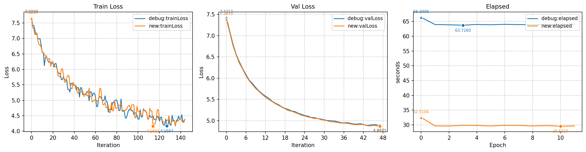
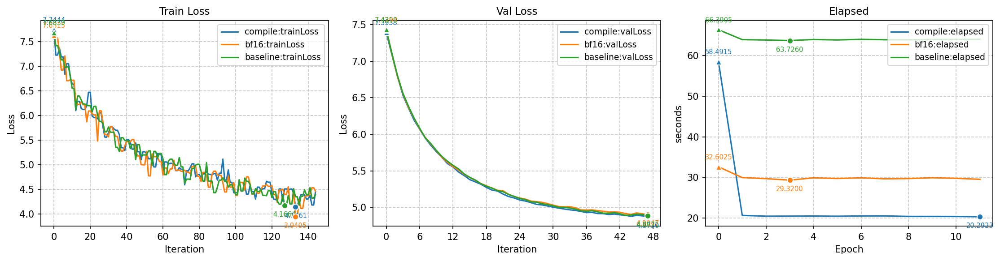
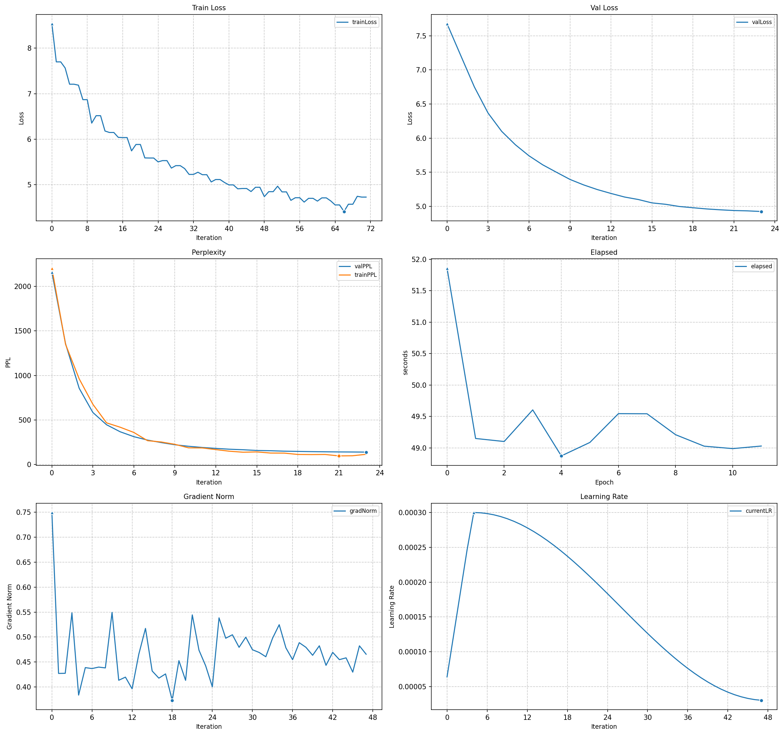
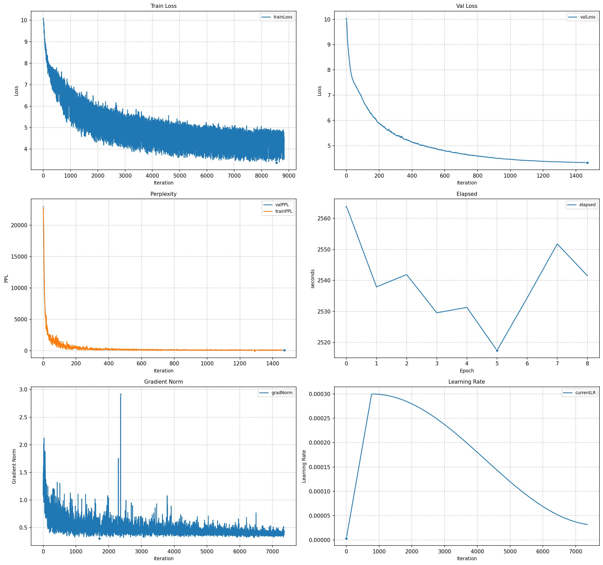

In this follow-up to my post [Ⅰ. ScholarEtude Training Notes](scholar-etude-1.md), I want to further dig into the pretraining process of [ScholarEtude](https://github.com/y1yang0/scholar) GPT model and share some notes and thoughts along the way.

## Inspect Model Internals

这次我做了一个比较有意思的功能，接受输入tokens之后，可以在大模型关键节点输出每个token最相关的5个tokens（logits）。

```shell
Input: 杨过和 Ouput:{小龙女两人}
Attn#0:
杨过 -> 鬼鬼祟,我的确,彰,听到这里,所以你,怕你,我相信,多识,但我,你若是,一袭,篱,偶,所以我,我很
和 -> 蔼,�,氏,谐,�,他的剑,它的,这柄剑,程,闵柔,缓,小师妹,山壁,小师弟,剑阁
小龙女 -> 不开,反悔,无事,之手,隙,惚,囊中,此言,心念一动,醒来,睬,篱,兮,回答,仙长
两人 -> 一饮,间的,方式,相见,加起来,着身子,对视一眼,相逢,齐齐,中最,睽,羹,�,她身子,相对

FFN#0:
杨过 -> 彰,大奇,那小子,反悔,找你,鬼鬼祟,走出去,皆知,逮,之手,出现时,微顿,杀了你,夏栖,怕你
和 -> 蔼,�,氏,谐,亲王,�,林仙,缓,他的剑,和气,冰焰,之气,声说道,小棠,马匹
小龙女 -> 反悔,此言,兮,不开,之手,这样的话,醒了,醒来,惚,此话,蹈,的脸色,睡着了,练功,这样的人
两人 -> 着身子,一饮,间的,对视一眼,愣了,散人的,羹,里糊涂,泪来,的距离,身分,相逢,中最,方式,相斗

Attn#1:
杨过 -> 彰,皆知,走出去,鬼鬼祟,大奇,那小子,逮,找你,反悔,�,之手,出现时,无恙,掠出,微顿
和 -> 蔼,�,谐,氏,亲王,缓,�,林仙,拂水,他的剑,声说道,日,冰焰,倚天,身边的
小龙女 -> 反悔,醒了,此言,这丫头,这样的话,的脸色,兮,道友的,雏,之手,醒来,睬,惚,此话,无事
两人 -> 着身子,间的,一饮,对视一眼,愣了,羹,散人的,相逢,的距离,中最,里糊涂,方式,加起来,走后,之间的

FFN#1:
杨过 -> 大奇,彰,无恙,反悔,找你,那小子,皆知,鬼鬼祟,翼翼,微顿,之手,大悟,出现时,夏栖,这个机会
和 -> 蔼,谐,�,氏,声说道,亲王,林仙,�,缓,他的剑,一众,和气,芷若,声道,倚天
小龙女 -> 此言,这丫头,这番,这样的话,醒来,不喜,这样的人,此话,所说的,反悔,这话,无恙,不轻,的身子,这几句话
两人 -> 着身子,对视一眼,间的,一饮,的距离,愣了,之间的,走后,里糊涂,散人的,看时,相斗,对话,相会,交谈

Attn#2:
杨过 -> 无恙,彰,大奇,反悔,那小子,找你,之手,微顿,皆知,翼翼,呆了一,媸,惺,一呆,大悟
和 -> 蔼,谐,�,氏,�,亲王,缓,声说道,林仙,一众,声道,他的剑,和气,芷若,颜
小龙女 -> 这样的话,此言,这丫头,这番,无恙,此话,所说的,反悔,不喜,这话,醒来,之手,在旁,抿嘴,醒了
两人 -> 着身子,对视一眼,间的,一饮,的距离,对话,之间的,里糊涂,愣了,交谈,走后,相斗,之间,相会,一前一

FFN#2:
杨过 -> 无恙,大奇,彰,那小子,之手,反悔,找你,皆知,微顿,一呆,惺,说笑,呆了一,依言,出现时
和 -> 蔼,谐,氏,�,缓,声说道,亲王,�,林仙,一众,他的剑,声道,和气,我说,鞑
小龙女 -> 无恙,这丫头,此言,所说的,这样的话,这番,此话,在旁,兮,之手,阴魔,的身子,不喜,老人家,制住
两人 -> 对视一眼,着身子,间的,的距离,对话,之间的,一饮,交谈,一前一,相逢,相斗,走后,说话的声音,之别,身分

Attn#3:
杨过 -> 无恙,彰,找你,反悔,大奇,出现时,依言,说笑,之手,那小子,呆了一,微顿,媸,一呆,夏栖
和 -> 蔼,谐,氏,�,亲王,声说道,缓,�,林仙,一众,他的剑,我说,声道,芷若,小棠
小龙女 -> 无恙,这丫头,此言,所说的,在旁,这番,阴魔,兮,老人家,不喜,此举,这样的话,之手,心愿,这段时间
两人 -> 对视一眼,着身子,间的,的距离,对话,之间的,之别,一前一,一饮,交谈,相斗,相逢,走后,里糊涂,景

FFN#3:
杨过 -> 无恙,大奇,找你,依言,那小子,彰,反悔,一呆,大悟,之手,说笑,微顿,夏栖,呆了一,媸
和 -> 蔼,谐,氏,�,亲王,声说道,�,缓,我说,一众,林仙,他的剑,众位,芷若,书院的
小龙女 -> 无恙,这丫头,此言,所说的,之手,这番,此举,在旁,自幼,皓,幼,这段时间,兮,的身子,大悟
两人 -> 对视一眼,走后,之间的,间的,相斗,对话,的距离,着身子,相逢,之间,交谈,对望一眼,之别,一前一,说话的声音

Attn#4:
杨过 -> 无恙,大奇,说笑,依言,找你,反悔,那小子,一呆,偎,和她,大悟,呆了一,自幼,之手,之故
和 -> 蔼,谐,氏,�,亲王,林仙,声说道,缓,一众,�,我说,他的剑,芷若,声道,书院的
小龙女 -> 无恙,这丫头,嫣然一笑,咐,之手,此举,的背影,所说的,偎,兮,大悟,阴魔,自幼,心愿,的性命
两人 -> 对视一眼,之间的,间的,对话,之间,相斗,的距离,相逢,对望一眼,之别,走后,一前一,交谈,加起来,相视

FFN#4:
杨过 -> 无恙,依言,大奇,说笑,找你,一呆,那小子,和她,大悟,偎,反悔,自幼,若真,一振,呆了一
和 -> 蔼,谐,氏,�,亲王,�,林仙,声说道,我说,缓,一众,和气,声道,芷若,你说
小龙女 -> 这丫头,无恙,嫣然一笑,的背影,自幼,偎,和她,大悟,此举,是个很,咐,的身子,这段时间,心愿,虽然不知道
两人 -> 对视一眼,之间的,相斗,间的,对望一眼,走后,对话,相逢,之间,一前一,交谈,之别,相视,的距离,对视

Attn#5:
杨过 -> 无恙,依言,大奇,和她,一呆,那小子,好奇问道,偎,找你,大悟,自幼,说笑,彰,儿脸,之手
和 -> 蔼,谐,氏,�,林仙,亲王,声说道,缓,�,芷若,我说,书院的,声道,拓拔,一众
小龙女 -> 嫣然一笑,这丫头,的背影,无恙,和她,自幼,抿嘴,偎,是个很,的身子,咐,呆了一,心愿,此举,的一条
两人 -> 对视一眼,之间的,间的,相斗,对望一眼,对话,相逢,走后,之别,之间,一前一,的距离,相视,对视,交谈

FFN#5:
杨过 -> 无恙,依言,大奇,和她,一呆,好奇问道,那小子,找你,自幼,大悟,感激不尽,说笑,儿脸,再问,年幼
和 -> 蔼,谐,氏,�,亲王,林仙,缓,我说,�,声说道,你说,和气,拓拔,一众,芷若
小龙女 -> 嫣然一笑,这丫头,无恙,的背影,自幼,和她,抿嘴,呆了一,是个很,好奇问道,偎,此举,大悟,咬着嘴唇,不相信
两人 -> 对视一眼,相斗,之间的,对望一眼,间的,对话,相逢,一前一,之间,对视,走后,加起来,交锋,合力,之别

Attn#6:
杨过 -> 和她,洪七公,自幼,听她,见她,给她,依言,怔怔,蓉儿,愈,黄蓉,感到,依着,桃花岛,一呆
和 -> 蔼,蓉儿,芷若,小龙女,黄蓉,郭芙,谐,周芷若,全真教,赵敏,耶律齐,氏,洪七公,过儿,倚天
小龙女 -> 呆了一,无恙,这丫头,大悟,这段时间,现在已经,嫣然一笑,此举,的背影,好奇问道,是个很,就像是个,的计划,的态度,一段时间
两人 -> 之间的,对视一眼,对话,相斗,对望一眼,间的,之间,走后,相逢,一前一,之别,对视,加起来,交谈,交锋

FFN#6:
杨过 -> 和她,自幼,洪七公,听她,依言,见她,怔怔,给她,一呆,蓉儿,好奇心,愈,感到,大奇,却听得
和 -> 蔼,蓉儿,芷若,谐,小龙女,郭芙,黄蓉,氏,全真教,周芷若,倚天,我说,�,耶律齐,天鹰
小龙女 -> 无恙,这丫头,此举,呆了一,这段时间,现在已经,嫣然一笑,是想,自幼,是个很,虽然没有,一段时间,的背影,咬着嘴唇,还以为
两人 -> 之间的,对视一眼,相斗,对话,相逢,对望一眼,之间,间的,一前一,对视,合力,加起来,走后,联手,交谈

Attn#7:
杨过 -> 和她,洪七公,自幼,听她,见她,蓉儿,怔怔,黄蓉,给她,依言,依着,好奇问道,自行,无恙,心愿
和 -> 蔼,蓉儿,芷若,谐,黄蓉,小龙女,郭芙,全真教,周芷若,倚天,�,洪七公,氏,赵敏,我说
小龙女 -> 无恙,此举,呆了一,这丫头,这段时间,现在已经,担任,是想,是个很,咬着嘴唇,的能力,从而,都觉得,和她,虽然没有
两人 -> 之间的,对视一眼,对话,相斗,相逢,之间,间的,一前一,对望一眼,联手,加起来,面面相,交锋,走后,相遇

FFN#7:
杨过 -> 和她,自幼,洪七公,依言,见她,怔怔,听她,好奇问道,给她,依着,大奇,无恙,黄蓉,蓉儿,衷
和 -> 蔼,蓉儿,芷若,谐,黄蓉,小龙女,�,氏,全真教,郭芙,我说,你说,周芷若,倚天,缓
小龙女 -> 无恙,这丫头,此举,担任,呆了一,这段时间,咬着嘴唇,和她,自幼,和那些,是想,那小子,好奇问道,嫣然一笑,也不至于
两人 -> 之间的,对视一眼,相斗,对话,联手,相逢,合力,对望一眼,加起来,之间,间的,相视,对视,相对,一前一

Attn#8:
杨过 -> 洪七公,和她,自幼,黄蓉,小龙女,见她,听她,怔怔,给她,蓉儿,依着,那知,其时,依言,一灯
和 -> 蔼,蓉儿,芷若,谐,小龙女,黄蓉,全真教,�,郭芙,周芷若,氏,倚天,赵敏,耶律,耶律齐
小龙女 -> 无恙,担任,呆了一,蹙,好奇问道,自幼,很好奇,和那些,跻,眼眸里,咬着嘴唇,这丫头,此举,徐渭熊,大悟
两人 -> 对视一眼,相逢,对话,相斗,之间的,联手,相视,合力,加起来,间的,对视,面面相,对望一眼,睽,相对

FFN#8:
杨过 -> 洪七公,和她,自幼,黄蓉,见她,给她,听她,怔怔,小龙女,依言,蓉儿,依着,衷,其时,桃花岛
和 -> 蔼,蓉儿,谐,芷若,小龙女,黄蓉,氏,�,周芷若,全真教,郭芙,缓,倚天,你说,我说
小龙女 -> 无恙,担任,自幼,和她,这丫头,此举,所居,这时候,那小子,的性命,骑在,年幼,的背影,徐渭熊,和那些
两人 -> 对视一眼,联手,相逢,之间的,对话,相斗,合力,对视,相视,间的,加起来,并肩,对望一眼,面面相,相对

Attn#9:
杨过 -> 洪七公,和她,黄蓉,自幼,见她,衷,小龙女,蓉儿,怔怔,听她,桃花岛,瑛姑,咱俩,给她,一灯
和 -> 蔼,蓉儿,谐,芷若,小龙女,�,耶律,黄蓉,拓拔,全真教,氏,郭芙,周芷若,完颜,嘉
小龙女 -> 无恙,担任,此举,扶住,和她,自幼,蹙,所居,骑在,年幼,这时候,身畔,的背影,一掠,那小子
两人 -> 联手,相逢,相斗,对视一眼,之间的,对话,合力,相视,对视,并肩,间的,一前一,相对,对峙,加起来

FFN#9:
杨过 -> 和她,自幼,见她,洪七公,奇道,心想,好生,依言,给她,心念一动,知,不懂,听她,怔怔,见他
和 -> 蔼,谐,蓉儿,�,小龙女,芷若,缓,我说,黄蓉,氏,你说,耶律,常人,全真教,拓拔
小龙女 -> 和她,年幼,无恙,此举,和,自幼,的,骑在,嫣然一笑,所居,那小子,的背影,担任,的性命,等人
两人 -> 联手,之间的,相逢,合力,相斗,对视一眼,对话,对视,相对,相视,并肩,间的,加起来,一前一,对峙

Attn#10:
杨过 -> 和她,自幼,见她,洪七公,听她,好生,给她,依言,奇道,死里,知,与她,怔怔,感到,不懂
和 -> 蔼,谐,蓉儿,小龙女,黄蓉,嘉,�,芷若,耶律,拓拔,缓,全真教,宋,我说,先前
小龙女 -> 和她,和,嫣然一笑,无恙,年幼,的,自幼,此举,等人,的性命,的背影,骑在,担任,那小子,在旁
两人 -> 联手,对话,相斗,相逢,之间的,相视,合力,对视一眼,并肩,对视,对望一眼,相对,一前一,对峙,面面相

FFN#10:
杨过 -> 和她,自幼,好生,见她,和,心念一动,心想,与,，,知,奇道,一见,感到,的,不懂
和 -> 蔼,谐,小龙女,先前,蓉儿,黄蓉,耶律,嘉,宋,徐,�,我说,缓,其余,拓拔
小龙女 -> 的,和,和她,等人,，,、,嫣然一笑,年幼,的心,自幼,骑在,的小,的脸,所居,的性命
两人 -> 联手,之间的,对视,相视,对话,合力,对视一眼,并肩,相斗,之间,相对,对望一眼,相逢,面面相,对峙

Attn#11:
杨过 -> 和她,自幼,见她,心想,好生,感到,知,和,给她,听,无暇,心念一动,见,见他,奇道
和 -> 蔼,她的,黄蓉,先前,小龙女,那位,徐,宋,谐,以前,“,耶律,其余,另外,完颜
小龙女 -> 的,和,等人,和她,、,的心,，,嫣然一笑,的小,所,自幼,年幼,手中的,的手,等三人
两人 -> 联手,相视,对视,并肩,对话,之间的,合力,对视一眼,对望一眼,相对,相斗,相逢,之间,不约而同,面面相

FFN#11:
杨过 -> 和她,自幼,，,和,的,见她,好生,心念一动,心想,无暇,不懂,大奇,感到,、,与
和 -> 蔼,她的,那位,先前,徐,黄蓉,宋,小龙女,其余,以前,另外,那个,谐,这,这些
小龙女 -> 的,和,、,，,等人,的心,和她,的小,的手,嫣然一笑,的脸色,所,的一,的脸,所说的
两人 -> 联手,相视,并肩,对视,之间的,合力,之间,对话,对视一眼,对望一眼,相对,相斗,不约而同,相逢,面面相

Attn#12:
杨过 -> 和她,自幼,见她,，,心想,感到,和,好生,的,给她,无暇,与,心念一动,与她,嫣然一笑
和 -> 蔼,黄蓉,她的,小龙女,先前,徐,一个,“,那位,宋,那个,耶律,她,李,另外
小龙女 -> 的,和,、,等人,，,和她,的心,相对,的小,的一,嫣然一笑,所,的手,所说的,并肩
两人 -> 联手,并肩,相视,对视,对视一眼,对望一眼,合力,相对,对话,之间的,相逢,之间,互,一前一,相斗

FFN#12:
杨过 -> 和她,，,自幼,的,和,见她,嫣然一笑,心念一动,好生,与,无暇,的心,感到,已,在旁
和 -> 她的,“,一个,蔼,徐,那位,黄蓉,这,她,另外,李,小龙女,那个,他的,宋
小龙女 -> 的,，,、,和,等人,的小,的心,和她,的一,相对,的手,所,嫣然一笑,所说的,的脸色
两人 -> 联手,并肩,对视,相视,相对,之间,之间的,对望一眼,合力,对视一眼,一起,互,对话,一前一,，

Attn#13:
杨过 -> 和她,自幼,，,见她,嫣然一笑,的,和,感到,心念一动,无暇,在旁,与,身上,已,心中
和 -> “,她的,一个,蔼,黄蓉,她,这,小龙女,那位,那个,雪宜,自己的,他的,另外,一
小龙女 -> 的,、,，,等人,和,的心,相对,的小,和她,嫣然一笑,的一,并肩,的手,的脸色,之间的
两人 -> 联手,并肩,对视,相视,相对,之间,对视一眼,之间的,一起,对话,对望一眼,互,合力,一前一,相逢

FFN#13:
杨过 -> ，,和她,自幼,的,和,嫣然一笑,见她,在旁,的心,与,心念一动,无暇,已,感到,忙
和 -> 雪宜,徐,那位,黄蓉,琼肜,一个,李,“,小,她的,唐小棠,小龙女,众人,那个,宋
小龙女 -> 的,，,、,等人,和,并肩,相对,的小,的心,之间的,的一,的手,的目光,的脸色,嫣然一笑
两人 -> 并肩,对视,联手,相视,相对,对望一眼,对视一眼,之间的,一前一,一起,之间,分别,对峙,合力,面面相

Attn#14:
杨过 -> 和她,自幼,，,见她,和,的,无暇,嫣然一笑,给她,与她,在旁,感到,已,心念一动,见他
和 -> 黄蓉,小龙女,两人,雪宜,徐,洪七公,唐小棠,她,“,那位,郭芙,琼肜,王,宋,李
小龙女 -> 并肩,的,相对,和,等人,、,，,相视,和她,之间的,一起,相处,同,夫妇,对望一眼
两人 -> 并肩,联手,对视,相视,相对,相距,对望一眼,一前一,互,对视一眼,合力,互相,之间的,一起,相逢

FFN#14:
杨过 -> ，,的,和她,和,自幼,与,已,在,“,心中,虽,早已,见她,所,的心
和 -> 黄蓉,小龙女,徐,她,王,“,李,两人,洪七公,雪宜,那位,小,宋,郭靖,众人
小龙女 -> ，,的,、,并肩,相对,和,等人,一起,之间,之间的,相视,同,相处,在一起,。
两人 -> ，,并肩,相对,联手,在,一起,都是,相距,早已,对视,同,相,之间,。,对望一眼

Attn#15:
杨过 -> ，,和她,和,的,自幼,与,见她,已,在,“,心中,与她,给她,见他,虽
和 -> 黄蓉,小龙女,她,洪七公,徐,杨过,郭芙,两人,郭靖,赵志敬,欧阳锋,王,“,李,宋
小龙女 -> ，,并肩,、,和,的,相对,等人,一起,同,相视,相处,相,和她,之间,两人
两人 -> ，,并肩,相对,联手,在,相距,相,一起,都是,对,同,分别,相视,对视,相处

FFN#15:
杨过 -> ，,的,与,和,在,“,已,。,从,和她,却,自,心中,一,所
和 -> 黄蓉,她,小龙女,徐,王,洪七公,“,小,众人,李,杨过,两人,郭靖,郭芙,武
小龙女 -> ，,的,、,和,在,。,相对,并肩,同,等人,之间,与,一起,对,都
两人 -> ，,在,相对,对,一,。,已,也,并肩,是,同,从,却,都是,早已

FinalNorm:
杨过 -> 和,与,，,已,在,和她,心中,的,自幼,从,所,却,虽,也,等
和 -> 黄蓉,小龙女,洪七公,郭芙,杨过,徐,郭靖,欧阳锋,陆无双,王,赵志敬,武,李莫愁,完颜,裘千仞
小龙女 -> 并肩,在,和,、,，,等,相对,两人,的,在一起,同,都,相处,一起,都是
两人 -> 并肩,在,，,相对,已,也,相,相距,都是,一,同时,联手,正,分别,对
```

观察到非常有意思的行为。

1. attn#6 点亮金庸宇宙
输入`杨过 和`两个token。`和`字在前几层0-5关联的token是`和蔼，和谐，和氏`，`杨过`关联的是`无恙，和她，大奇，好奇问道`，比较平平无奇。到了第6层attn突然开智了，`和`关联了`蓉儿，芷若，小龙女`，`杨过`关联`洪七公，和她，自幼`，直接点亮了金庸宇宙高维空间（这里我用了很多本小说训练）。最终15层高频候选`黄蓉，她，小龙女`的logits高达700+，无比自信，靠最后一层的RMSNorm强行压到10以内。我这个才15层的小模型都这样了，对于商业模型后面的logits估计更严重，我感觉DeepNorm这些技术可能很有用，未来可以试试。

2. 深层网络感知到人物关系
第一次模型接出了`小龙女`，然后开始推理下一个词。没有明显的亮点，整体上10-15层看到`杨过和小龙女`，关联出了`和，在一起，夫妇，并肩，相处，相视`，认为他们俩是有比较密切关系的，最终推理出`两人`

3. ffn#1推理token
下一次推理，ffn#1率先根据`两人`关联出`对视一眼，对话，交谈，相会`。

整体给我的感觉是，attn层擅长点亮与token关联的高维空间token，ffn擅长发现token的关系，有点推理和延申的味道。


## Leverage Torch

### 1. SPDA

虽然我喜欢古法编程，自己实现模型重要组件，但是我也发现flash attention有些过于复杂，从零一个基本能用的版本都需要巨大的努力，所以为了加速预训练过程，只能用torch自带的`scaled_dot_product_attention`，它底层用了flash attention。

改成flash attention之后，速度确实快了很多，之前金庸15本书+30M模型参数的配置下，**手写版本一轮训练大概210s，spda版本一轮大概175s**（RTX3060 diff），节省了很多生命。

改用SPDA后，我还发现一个问题，老版本的train loss和val loss都比spda版本低，可能是因为底层用的精度不一样，导致有些细微区别。因为截至目前推理效果都比较差，很难对比两个说梦话的版本哪个更差。让大模型看了下也都是半斤八两的水平，所以结论是训练加速16%，loss指标差，但是推理效果没有显著变差，spda肯定是要保留的。

### 2. BF16
还没完，隔天同事告诉我，没有用autocast自动混合精度切换到[bf16](https://en.wikipedia.org/wiki/Bfloat16_floating-point_format)(b是Brain...Google Brain团队发明的浮点格式)，torch默认的float32精度在底层并不会使用flash attention的版本，所以我之前的测试是有问题的，那个性能提升应该就是纯粹的spda也比手写的版本要好。

所以我用上了`autocast`，在它管理的上下文内，它会视情况自动切换计算精度，比如遇到spda并且flash attn的各种条件满足，它就会切到bf16：

```python
   def train(self):
      ...
      with torch.autocast(
            device_type=self.model.device.type,
            dtype=torch.bfloat16,
            enabled=torch.cuda.is_bf16_supported(),
         ):
            output = self.model.compute(input)
            loss = self.model.loss(output, target)
         self.model.backward(loss)
```

这里只有模型计算和loss计算是包裹在autocast区域，backward是不需要的，pytorch也有特别提示：

> autocast should wrap only the forward pass(es) of your network, including the loss computation(s). Backward passes under autocast are not recommended. Backward ops run in the same type that autocast used for corresponding forward ops.

backward 中很多梯度累积、参数更新相关操作最好保持默认精度。使用bf16之后，**一轮从60s降低到了30s**（H20-like diff），免费的训练加速。



### 3. Torch Compile

还有一个免费午餐是`torch.compile`，看第三幅图，除了第一轮预热之外，其他的轮次运行时间从**30s再降到了20s**（H20-like diff）



但同事告诉我`torch.compile`有可能有精度问题。我查了一下，主要是说浮点数运算不满足标准的结合律，即`(a+b)+c`不一定完全等于`a+(b+c)`，编译器算子融合会出现这些问题，但是我的训练过程对精度要求本来就不高，训练加速还是很有用的，所以这个优化也保留了。

### 4. TensorFloat32

又一个免费午餐，nvidia tensor float32，代替普通float32。但是我现在核心计算都用bf16，测下来基本上没什么训练加速，还是留着，RTX机器可能有用：

`torch.set_float32_matmul_precision('high') `

### 5. AdamW Fused

又一个免费午餐

> The foreach and fused implementations are typically faster than the for-loop, single-tensor implementation, with fused being theoretically fastest with both vertical and horizontal fusion. As such, if the user has not specified either flag (i.e., when foreach = fused = None), we will attempt defaulting to the foreach implementation when the tensors are all on CUDA. Why not fused? Since the fused implementation is relatively new, we want to give it sufficient bake-in time. To specify fused, pass True for fused. To force running the for-loop implementation, pass False for either foreach or fused.


## Cosine Annealing with Warmup

之前[文章](scholar-etude-2.md)其实我已经尝试过余弦退火，但是效果一般，后面陆陆续续了解了一下，原因很可能是没有加上WarmUp，开局就是大的LR，导致效果不好，所以我又重新加上带WarmUp过程的余弦退火scheduler：

```python
   def setupScheduler(self, totalSteps):
      warmupSteps = int(totalSteps * 0.1)
      # start from peakLR * 0.01 to peakLR * 1
      warmupScheduler = torch.optim.lr_scheduler.LinearLR(
         self.optimizer, start_factor=0.01, end_factor=1.0, total_iters=warmupSteps
      )
      decaySteps = int(totalSteps - warmupSteps)
      # decay from peakLR * 1 to minLR
      decayScheduler = torch.optim.lr_scheduler.CosineAnnealingLR(
         self.optimizer, T_max=decaySteps, eta_min=self.config["minLR"]
      )
      self.scheduler = torch.optim.lr_scheduler.SequentialLR(
         self.optimizer,
         schedulers=[warmupScheduler, decayScheduler],
         milestones=[warmupSteps],
      )
```

学习率是从0慢慢预热，爬升到峰值`3e-4`，然后慢慢余弦衰退到`3e-5`。



从val loss来看，加上这个没有造成性能变差，而且这几乎是大模型标配了，必须保留

## Training Dashboard

之前我看训练效果，都是看log、看推理采样，有点刀耕火种，比较累，现在我实现了一个简单的监控面板，方便了很多，它可以监控训练过程的重要监控指标：

- Train Loss: 监控训练有没有稳步进行
- Val Loss：模型泛化能力监控
- Perplexity：约等于val loss，但是更直观，模型在N个词里面困惑到底输出哪个词
- Elapsed：跑一个epoch的时间
- Gradient Norm：梯度范数，梯度有没有爆炸，训练有没有崩
- Learning Rate：加上余弦退火之后，学习率是变化的，监控变化值

这里重点说一下梯度范数(Gradient Norm)。说它之前先说下loss。首先模型走完softmax之后，会给词汇表里面每个token分配一个概率，举个例子，比如说词汇表是`["华山论剑","乔峰","天山童姥"]`，正确的词是`"乔峰"`

- 如果模型预测`"乔峰"`概率99%，loss= -ln(0.99) = 0.01，相当准确
- 如果模型预测`"乔峰"`概率1%, loss= -ln(0.01)=4.6，错的离谱

loss只关心模型给正确的token分配了多少概率，然后对数取反，**loss就表示模型预测结果和真实结果的差距。**

梯度就是loss(a,b,c)对所有分量的偏导数，导数是某个点瞬间斜率，偏导就是a,b,c某个分量的斜率，有点像在山坡上，有三条下去的路，哪一条坡度最斜，这个坡度就是梯度。**梯度就表示让loss增长最快的方向。**

梯度表示方向向量，梯度范式就表示这个向量的长度，它可以回答这个方向有多陡峭。结合到训练过程，这个指标的含义就是当前模型更新权重的剧烈程度

## 57M model with 42M data



之前所有训练都是30M模型+5M金庸数据训练。这次开始加大规模，用的57M模型+42M各种武侠小说，训练的过程比较不错，所有指标收敛都很顺利，但是推理效果比较一般：

```js
{"idx": 0, "input": "杨过和小龙女在", "output": "二人之间，对两人相隔甚远。\n甄志丙见李莫愁如此轻狂，不由得连连摇头。"}
{"idx": 1, "input": "神雕大侠", "output": "，你也不必再说什么。”\n苏樱道：“我不喜欢你。我……我还会给你个教训才是"}
{"idx": 2, "input": "韦小宝和双儿", "output": "也都差不多。\n他扮了个鬼脸，说道：“这贼和尚跟上清观、下"}
{"idx": 3, "input": "围攻光明顶", "output": "的四大高手，都退到了这地步。\n“嘿嘿！”听得鲍楚雄、林"}
{"idx": 4, "input": "郭靖和黄蓉", "output": "三人商量，到得后来，便对二人又斗了。\n两人在商家堡中相斗"}
{"idx": 5, "input": "张无忌", "output": "已猜出他身世隐秘，只道他们二人必定知其理。\n慕容复说道：“好，"}
{"idx": 6, "input": "令狐冲说", "output": "，自己和盈盈相处日久，不由得心慌意乱。\n过了良久，她顿了一顿，"}
{"idx": 7, "input": "华山论剑", "output": "，一经破灭，再以上乘武功抵挡。”\n此言一出，众人无不失色。他"}
{"idx": 8, "input": "桃花岛上", "output": "，连云万山、梁萧、花无媸等情侣也全都消失无踪"}
{"idx": 9, "input": "令狐冲看到盈盈，问道", "output": "：“大师……”\n岳不群微笑道：“令狐掌门，咱们师兄弟二人都曾听师父说过。”令狐冲听到"}
{"idx": 10, "input": "他使出一剑", "output": "，一剑刺破他的身体。\n剑锋芒在鞘中穿透而过时，鲜血被"}
{"idx": 11, "input": "女子冷哼一声", "output": "，道：“小友对此宝倒没有兴趣了。韩某若是对在下如此客气"}
{"idx": 12, "input": "你懂剑法吗？", "output": "我教你，你也学个屁！”\n石破天见母亲道：“姑娘心高气傲，实"}
{"idx": 13, "input": "一剑刺中了", "output": "敌人要害，其余六人齐叫：“请！”\n宋远桥道：“遵命。”\n虚竹将长剑"}
```

和之前30M模型可能有一点区别，行文比较流畅，文风还可以，但是区别不大，没有逻辑，世界观混杂。

## Summary

| Version | Performance |
| :--- | :--- |
| Inspect Model Internals | 实现了在大模型关键节点输出每个token最相关logits的调试功能，观察到前三层偏向"刻板印象"，中间层做语法构建，最后层收敛到高置信度输出。 |
| SPDA | 使用torch自带的`scaled_dot_product_attention`替代手写版本，**训练速度提升约16%**（210s→175s），loss指标略有差异但推理效果无显著变化。 |
| BF16 | 通过`autocast`启用混合精度训练，触发flash attention优化，**一轮训练时间从60s降至30s**，免费的训练加速。 |
| Torch Compile | 使用`torch.compile`进行算子融合优化，除首轮预热外，**一轮训练时间从30s再降至20s**，虽有浮点精度问题但对训练影响不大。 |
| TensorFloat32 | 启用nvidia tensor float32替代普通float32，但核心计算已用bf16，实测基本无额外加速，保留备用。 |
| AdamW Fused | 启用fused版本AdamW优化器，理论上通过垂直和水平融合实现最快速度，属于免费的性能提升。 |
| Cosine Annealing with Warmup | 之前纯余弦退火效果不佳，补充了Warmup预热阶段（LR从0.01×峰值爬升），配合余弦衰退到minLR，val loss未变差，已成大模型标配。 |