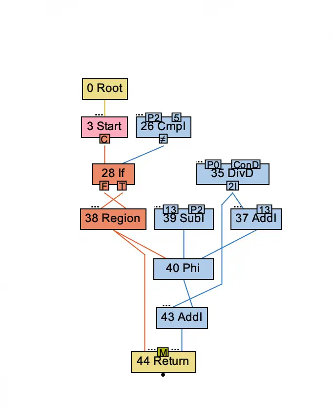
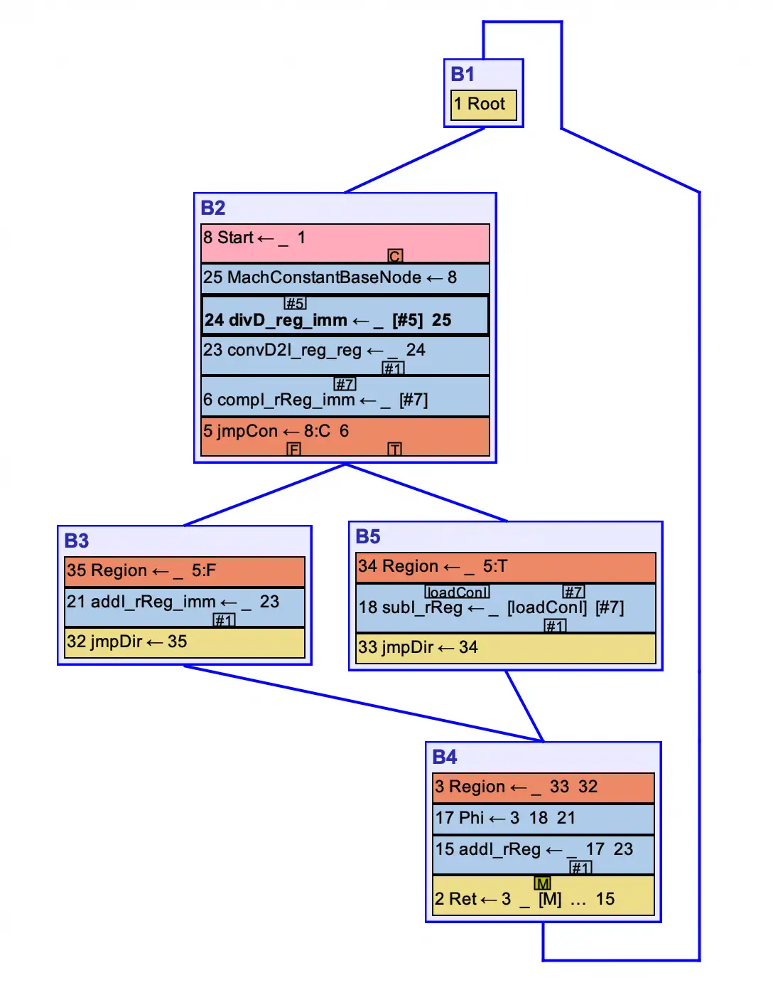
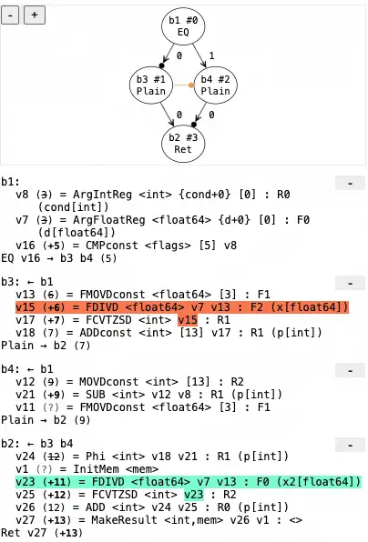
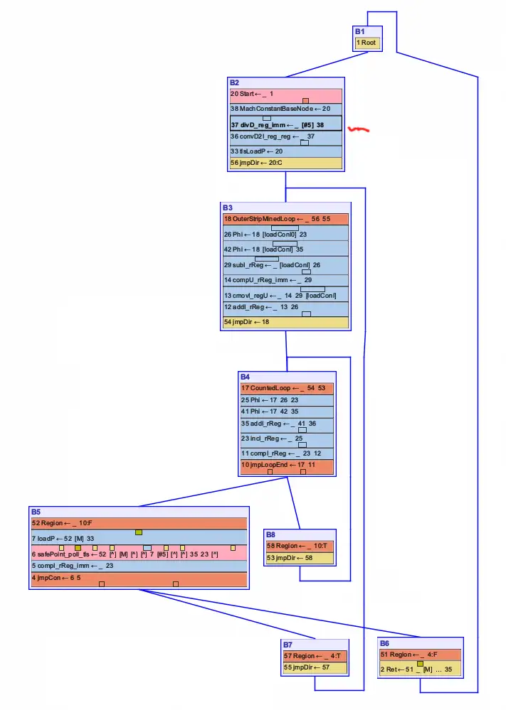
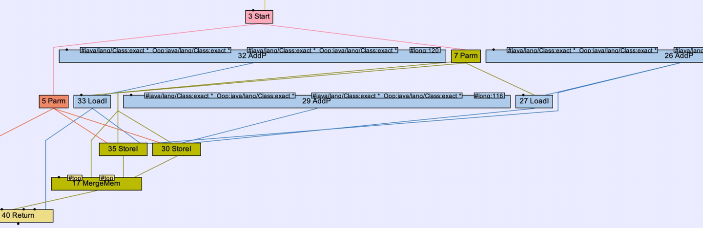

I've seen questions on online forums asking about the primary advantage of a **Sea of Nodes (SoN) IR** compared to a traditional **SSA-based IR** like LLVM's. This inspired me to write an article to share my perspective. It's been a while since I worked on JVM development, and I don't claim to be an expert, so this is just my personal understanding, offered for reference.

Consider the following code:
```java
static int test(double d, int cond) {
  int p = 13;
  if (cond == 5) {
    double x = d / 3.; // line 4
    p += (int)x;
  } else {
    p -= cond;
  }
  double x2 = d / 3.; // duplicate with line 4
  p += (int)x2;
  return p;
}
```

**The great advantage of a Sea of Nodes (SoN) IR is that during its construction, control flow can be ignored. Data nodes float freely, untethered from the traditional constraints of the def-use relationship.** In my opinion, this is its single greatest strength.

In the example above, we can spot the redundant calculation on lines 4 and 9. Even though the definition (def) on line 4 does not dominate the code path leading to the use on line 10, SoN can still identify and reuse the value. This is because the Global Code Motion (GCM) pass (specifically, the [algorithm](https://dl.acm.org/doi/10.1145/207110.207154) Cliff Click proposed for SoN IR) will resolve the placement of these nodes.




In contrast, value numbering in a traditional SSA IR is typically based on a dominator tree. It must respect the rule that a definition must dominate all its uses. If a definition is in one branch (the if block) and a potential reuse is in a later block not dominated by the first, a traditional value numbering pass cannot see this opportunity and thus cannot eliminate the redundancy. This is the core advantage of SoN over traditional IRs, and the GCM algorithm is a natural consequence of this design.



In a SoN graph, data nodes are "globally floating," free from the shackles of a CFG. Value numbering is inherently global and doesn't need to consider the dominator tree. Nodes can be uniqued simply by hashing their inputs and operation. As a result, the parsing phase ensures that only one instance of any given calculation exists in the graph, effectively eliminating redundancy from the start.

This "floating" property has another major benefit: GCM effectively performs Loop-Invariant Code Motion (LICM) for free. Before the GCM phase, the optimizer doesn't need to be aware that a Div node is inside a loop; it can be treated like any other node. Later, the "schedule early" phase of GCM will naturally hoist it out of the loop. LICM becomes an emergent property of the GCM algorithm, not a separate, complex pass.



Many cheap, powerful optimizations occur during this "liquid" parsing stage, which can reduce the size of the IR and simplify subsequent optimization phases. However, after the GCM pass is complete, the IR becomes "fragile". This means it has been solidified into a structure that is very similar to a traditional SSA+CFG form. At this point, the "floating" property is lost, and with it, the ability to perform dominance-free global value numbering.

Calling it "fragile" might actually be an understatement. The truth is, if we fail to handle anti-dependencies properly, the generated code won't just be fragile—it will be fundamentally incorrect. Consider the following code snippet:

```java
static int i=2,j=3,k=9;
int test(int x) {
    j = i;     // 30#StoreI
    i = k;     // 35#StoreI
    return i ; // at this point, i==9,j==2
}
```

The corresponding IR looks like this:



Here, 35#StoreI updates i, 30#StoreI updates j, 27#LoadI reads i, and 33#LoadI reads k. The expected execution sequence mapped from the IR is:

1. Execute 27#LoadI to read the original value of i
2. Execute 35#StoreI to read k and assign its value to i
3. Execute 30#StoreI to assign the value read by 27#LoadI into j
4. Final state: i == 9, j == 2

However, because there is no explicit dependency edge between 27#LoadI and 35#StoreI, and they access the same memory slice (meaning they share the same alias type), the nodes can freely float. As a result, the execution order could completely flip to:

1. Execute 35#StoreI to read k and assign its value to i
2. Execute 27#LoadI to read the new value of i
3. Execute 30#StoreI to assign this newly read value into j
4. Final state: i == 9, j == 9 **WRONG**

Therefore, during the GCM phase, the compiler must explicitly insert **an anti-dependence edge**. This adds 27#LoadI as an extra input to 35#StoreI, effectively "tethering" the store node to prevent it from floating wildly, guaranteeing that 27#LoadI executes first.

This reveals a crucial caveat: even SoN's greatest superpower—the "floating" nature of its nodes—comes with strings attached. While pure data nodes can drift around freely, memory-related nodes demand meticulous management. To distinguish and handle them correctly, the compiler is forced to introduce Type-Based Alias Analysis (TBAA), invent the concept of Memory Slices, and utilize MergeMem nodes to converge memory states. These are the hidden "complexity assassins" lurking beneath the elegant surface of the Sea of Nodes.

References:
- [A Simple Graph-Based Intermediate Representation](https://www.oracle.com/technetwork/java/javase/tech/c2-ir95-150110.pdf)
- [From_Quads_to_Graphs_An_Intermediate_Representation's_Journey](https://softlib.rice.edu/pub/CRPC-TRs/reports/CRPC-TR93366-S.pdf)
- [C2 The JIT In HotSpot](https://assets.ctfassets.net/oxjq45e8ilak/12JQgkvXnnXcPoAGoxB6le/5481932e755600401d607e20345d81d4/100752_1543361625_Cliff_Click_The_Sea_of_Nodes_and_the_HotSpot_JIT.pdf)