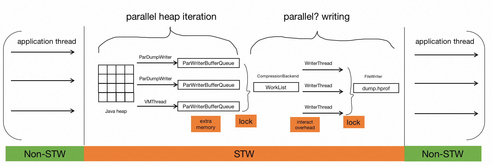
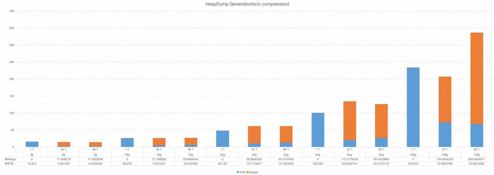

### Motivation
Recently, I implemented [Two-phase Segmented Heap Dump](https://bugs.openjdk.org/browse/JDK-8306441) for JVM.

During the heapdump, Java application must pause execution and wait for the VM to complete heapdump before resuming. this is a well-known pain. [JDK-8252842](https://bugs.openjdk.org/browse/JDK-8252842) have added parallel support to heapdump in an attempt to alleviate this pain. However, in that patch, all concurrent threads competitively write heap data to the same heap file, and more memory is required to maintain the concurrent buffer queue and related stuff. In experiments, we did not feel a significant performance improvement from that.

The minor-pause solution, which is presented in this article, is a two-phase segmented heap dump:

- Phase one(STW): Concurrent threads directly write data to segmented heap files. This process must take place during STW, which is guaranteed by [safepoint](https://openjdk.org/groups/hotspot/docs/HotSpotGlossary.html#safepoint). (**Application is paused**)
- Phase two(Non STW): Multiple heap files are merged into a complete heap dump file. STW is not needed for this phase. (**Application is resumed**)

Now concurrent worker threads are not required to maintain a buffer queue, which would result in more memory overhead, nor do they need to compete for locks. In this way, it significantly **reduces 71~83% application pause time**.

The changes in the overall design are as follows:

Figure1. Before

Figure2. After

### Performance evaluation

 | Memory | NumThread | Compress | Phase 1 STW | Phase 2 Merge | Total   |
 | ------ | --------- | -------- | ----------- | ------------- | ------- |
 | 8g     | 1 T       | N        | 15.612      | 0             | 15.612  |
 | 8g     | 32 T      | N        | 2.561725    | 11.936275     | 14.498  |
 | 8g     | 32 T      | C1       | 2.3084878   | 11.8895122    | 14.198  |
 | 8g     | 32 T      | C2       | 10.9355128  | 10.9464872    | 21.882  |
 | 8g     | 96 T      | N        | 2.6790452   | 11.3329548    | 14.012  |
 | 8g     | 96 T      | C1       | 2.3044796   | 1.2845204     | 3.589   |
 | 8g     | 96 T      | C2       | 9.7585151   | 10.4604849    | 20.219  |
 | 16g    | 1 T       | N        | 26.278      | 0             | 26.278  |
 | 16g    | 32 T      | N        | 5.231374    | 21.185626     | 26.417  |
 | 16g    | 32 T      | C1       | 5.6946983   | 0.8433017     | 6.538   |
 | 16g    | 32 T      | C2       | 21.8211105  | 19.3118895    | 41.133  |
 | 16g    | 96 T      | N        | 6.2445556   | 20.8964444    | 27.141  |
 | 16g    | 96 T      | C1       | 4.6007096   | 1.6582904     | 6.259   |
 | 16g    | 96 T      | C2       | 19.2965783  | 19.7104217    | 39.007  |
 | 32g    | 1 T       | N        | 48.149      | 0             | 48.149  |
 | 32g    | 32 T      | N        | 10.7734677  | 50.8695323    | 61.643  |
 | 32g    | 32 T      | C1       | 10.1642097  | 0.7387903     | 10.903  |
 | 32g    | 32 T      | C2       | 43.8407607  | 44.3112393    | 88.152  |
 | 32g    | 96 T      | N        | 13.1522042  | 48.2797958    | 61.432  |
 | 32g    | 96 T      | C1       | 9.0954641   | 0.7895359     | 9.885   |
 | 32g    | 96 T      | C2       | 38.9900931  | 41.5839069    | 80.574  |
 | 64g    | 1 T       | N        | 100.583     | 0             | 100.583 |
 | 64g    | 32 T      | N        | 20.9233744  | 113.7776256   | 134.701 |
 | 64g    | 32 T      | C1       | 18.5023784  | 0.8556216     | 19.358  |
 | 64g    | 32 T      | C2       | 86.4748377  | 86.2321623    | 172.707 |
 | 64g    | 96 T      | N        | 26.7374116  | 99.3425884    | 126.08  |
 | 64g    | 96 T      | C1       | 16.8101551  | 1.1278449     | 17.938  |
 | 64g    | 96 T      | C2       | 80.1626621  | 88.8403379    | 169.003 |
 | 128g   | 1 T       | N        | 233.843     | 0             | 233.843 |
 | 128g   | 32 T      | N        | 72.9945768  | 134.0654232   | 207.06  |
 | 128g   | 32 T      | C1       | 36.399436   | 0.605564      | 37.005  |
 | 128g   | 32 T      | C2       | 172.8942958 | 221.1317042   | 394.026 |
 | 128g   | 96 T      | N        | 67.6815929  | 268.6634071   | 336.345 |
 | 128g   | 96 T      | C1       | 35.2457306  | 0.9842694     | 36.23   |
 | 128g   | 96 T      | C2       | 162.2924705 | 235.0995295   | 397.392 |

Table1. heap dump generation(full)

| Memory | NumThread | Phase 1 STW | Phase 2 Merge | Total   |
| ------ | --------- | ----------- | ------------- | ------- |
| 8g     | 1 T       | 15.612      | 0             | 15.612  |
| 8g     | 32 T      | 2.561725    | 11.936275     | 14.498  |
| 8g     | 96 T      | 2.6790452   | 11.3329548    | 14.012  |
| 16g    | 1 T       | 26.278      | 0             | 26.278  |
| 16g    | 32 T      | 5.231374    | 21.185626     | 26.417  |
| 16g    | 96 T      | 6.2445556   | 20.8964444    | 27.141  |
| 32g    | 1 T       | 48.149      | 0             | 48.149  |
| 32g    | 32 T      | 10.7734677  | 50.8695323    | 61.643  |
| 32g    | 96 T      | 13.1522042  | 48.2797958    | 61.432  |
| 64g    | 1 T       | 100.583     | 0             | 100.583 |
| 64g    | 32 T      | 20.9233744  | 113.7776256   | 134.701 |
| 64g    | 96 T      | 26.7374116  | 99.3425884    | 126.08  |
| 128g   | 1 T       | 233.843     | 0             | 233.843 |
| 128g   | 32 T      | 72.9945768  | 134.0654232   | 207.06  |
| 128g   | 96 T      | 67.6815929  | 268.6634071   | 336.345 |

Table2. heap dump generation(w/o compression)

> N.B. all compression benchmark data are based on -gz=9, i.e. strongest compression
> - *N* means no compression
> - *C1* means all objects are byte[] in heap and they are all empty
> - *C2* means all objects are byte[] in heap and they are full of random data
> - For parallel dump, *Total* = *Phase 1 STW* + *Phase 2 Merge*.
> - For serial dump, *Total* = *Phase 1 STW*

Figure3. heap dump generation(full)

Figure4. heap dump generation(w/o compression)

When compression is enabled, STW/Total time heavily depends on the sparseness of the application heap. If the heap is full of compressible objects(e.g. all objects are empty byte array), Total ≈ STW, merge process is incredibly fast. If the heap data is not suitable for compression(e.g. all objects are full of random data), the STW reduction is not appealing, the total dump time is also increased.

### User Perspective
When executing commands such as `jmap` or `jcmd GC.heap_dump` to initiate the heapdump, the VM intelligently selects an appropriate number of parallel threads based on various factors. These factors include the type of garbage collector in use, the number of processors available, the heap size, and the degree of fragmentation. By considering these factors, the VM strives to perform the heapdump in parallel whenever feasible.

In cases where parallel heapdump is not possible due to certain constraints, the VM gracefully falls back to using a single thread for the heapdump process. In such scenarios, the heapdump behavior remains consistent with the previous approach. To gain more insights into the heapdump process, the `-Xlog:heapdump` option can be utilized to observe and analyze the details of the heapdump.

### Conclusion
Overall, the introduction of the two-phase approach effectively reduces the application pause time during the heapdump process, it is important to note that the total time required for the heapdump itself __may__ slightly increase. However, considering the reduction of STW time, I think it is an acceptable trade-off. This optimization solely focuses on minimizing the impact on the application pause time, there is still room for optimization in the second merge phase, e.g. merge segmented heap files via `sendfile`, it's more efficient than the `read`+`write` combination, which would require transferring data to and from user space. This has been implemented in [JDK-8314021](https://bugs.openjdk.org/browse/JDK-8314021).